**Identificação**

**TÍTULO DO PROJETO:**

**ARQUITETURA DE INTEGRAÇÃO DE AGENTES ESPECIALISTAS EM AMBIENTES
CORPORATIVOS.**

**Linha do Projeto: Inteligência Artificial / Arquitetura de Software /
Sistemas Distribuídos**

**Autor:** Flavia Antonioli de Souza

**Data da proposta:** 27/06/2026

**Versão:** 3.0

RFC: Request for Comments — Projeto de Portfólio

# Abstract

Este documento descreve a proposta de uma arquitetura modular e
*plug-and-play* para a orquestração de agentes de inteligência
artificial em ecossistemas corporativos. O objetivo é mitigar a
fragmentação do conhecimento técnico e funcional, reduzindo a
dependência de especialistas humanos e otimizando o *lead time*
operacional por meio de contratos formais, validação cruzada e
rastreabilidade integral.

# 

# 1. Visão de Produto e Impactos

O desenvolvimento de software em ecossistemas corporativos de grande
dimensão, como plataformas de gestão empresarial (ERP), enfrenta um
desafio crítico: a fragmentação do conhecimento. Em ambientes onde
coexistem sistemas legados, arquiteturas modernas e múltiplos domínios
de negócio, a execução de tarefas complexas deixa de ser um desafio
estritamente técnico e torna-se um gargalo de orquestração e integração
de saberes.

Para preencher essa lacuna estrutural, este documento propõe o
desenvolvimento de um Ecossistema de Integração de Agentes
Especialistas, concebido sob uma arquitetura modular e plug-and-play. A
solução é considerada extensível porque permite que novas Agent Skills
sejam criadas, importadas, validadas e registradas no catálogo da
plataforma sem necessidade de alteração direta no núcleo do sistema.
Dessa forma, a arquitetura pode evoluir de maneira incremental,
acompanhando novas demandas técnicas, regras de negócio e tecnologias
corporativas.

A principal proposta de valor reside na sua arquitetura preparada para o
crescimento contínuo. Por meio de um Orquestrador de Processos central,
o ecossistema é capaz de receber dinamicamente novos agentes artificiais
e integrar novas *Agent Skills* (capacidades modulares). Esta visão
garante que o ambiente não seja estático; pelo contrário, permite que a
organização acople novos especialistas e integre conhecimentos
distribuídos para responder a novas necessidades tecnológicas, mitigando
a dependência excessiva de recursos humanos isolados e reduzindo
substancialmente o *lead time* operacional.

## 

## 1.1 Contexto e Problema

A evolução tecnológica em grandes organizações não ocorre de forma
uniforme. A execução de tarefas críticas, como a modernização de
funcionalidades, exige a síntese de domínios variados. Atualmente, a
integração desses ecossistemas depende de processos humanos manuais e
síncronos, o que gera ambientes rígidos e difíceis de escalar. As
limitações severas incluem:

- **Gargalos de Disponibilidade e Rigidez:** Dependência crítica de
  poucos especialistas (*experts*), criando pontos únicos de falha.
  Quando uma nova tecnologia é introduzida, o gargalo aumenta, pois não
  há uma forma estruturada de acoplar esse novo conhecimento ao fluxo de
  trabalho.

- **Degradação de Contexto (Efeito "Telefone sem fio"):** Perda
  progressiva de informações vitais durante *hand-offs* manuais entre
  analistas, arquitetos e desenvolvedores.

- **Análise de Impacto Difusa:** A ausência de uma visão unificada eleva
  o risco de regressões, retrabalho e inconsistências arquitetônicas em
  sistemas interdependentes.

## 

## 1.2 Origem da Demanda e Evidências

A demanda originou-se da análise de uma empresa brasileira de grande
porte do setor de desenvolvimento de software ERP. Observou-se que a
fragmentação do conhecimento não representa apenas uma percepção
subjetiva, mas uma limitação estrutural da rede de desenvolvimento.

A análise detalhada da matriz de competências do time de produto
permitiu identificar a severidade da fragmentação do conhecimento por
meio de indicadores de lacuna. No Quadro 1 são categorizados os
principais riscos operacionais identificados, relacionando a situação
atual, seus impactos e a solução proposta pela arquitetura de integração
de agentes especialistas.

Quadro 1: Matriz de Evidências da Fragmentação de Conhecimento

|  |  |  |  |
|:--:|:--:|:--:|:--:|
| **Categoria** | **Situação Atual** | **Impacto** | **Solução Proposta** |
| Concentração de Conhecimento | Dependência de poucos especialistas | Atrasos e gargalos | Agent Skills especializadas |
| Lacuna de Prática | Falta de profissionais com conhecimento intermediário | Sobrecarga dos especialistas | Apoio por agentes especialistas |
| Isolamento de Domínio | Conhecimento disperso entre áreas | Retrabalho e erros | Orquestração multiagente |
| Evolução da Plataforma | Inclusão de novas capacidades exige esforço elevado | Baixa escalabilidade | Arquitetura plug-and-play |

(O detalhamento metodológico desta análise encontra-se no Apêndice A).

Além da análise documental da matriz de competências, a relevância
prática da proposta também foi reforçada pelo interesse observado entre
profissionais envolvidos em atividades de desenvolvimento, manutenção e
modernização tecnológica. Esse interesse decorre, principalmente, do
reconhecimento das dificuldades recorrentes associadas à interpretação
de sistemas legados, à dependência de especialistas humanos específicos
e à perda de contexto entre etapas do desenvolvimento.

Assim, a demanda não se limita a uma hipótese acadêmica. Ela reflete uma
necessidade prática percebida em ambientes corporativos de software:
estruturar uma arquitetura capaz de organizar a interação entre usuários
técnicos, agentes especialistas, contratos de comunicação e mecanismos
de validação.

## 

## 1.3 Análise de Soluções Existentes (Benchmark)

Embora o mercado ofereça *frameworks* robustos para IA generativa, a maioria foca em automação de tarefas isoladas ou *pipelines*, carecendo de governança e contratos formais exigidos por ambientes corporativos. Abaixo, destacam-se as principais ferramentas e suas limitações no contexto desta pesquisa (o estudo aprofundado dessas tecnologias encontra-se no Apêndice B):

*LangChain / LangGraph:* Oferece recursos robustos para construção de agentes, integração com ferramentas, RAG e fluxos multiagentes. No entanto, sua adoção em ambientes corporativos ainda exige decisões arquiteturais adicionais relacionadas à governança, contratos formais, rastreabilidade, validação de saídas e controle do ciclo de vida dos agentes.

*AutoGPT*: Focado na autonomia voltada a objetivos genéricos. Apresenta baixo controle de fluxo, previsibilidade e não foi desenhado para ecossistemas corporativos seguros.

*CrewAI*: Permite a simulação de equipes (papéis) e compartilhamento de contexto, porém, a comunicação baseia-se em troca textual livre, carecendo de contratos técnicos formais (ex: validação via *schemas* rígidos). 

*Microsoft AutoGen:* Possibilita a construção de conversações e fluxos colaborativos entre agentes, incluindo execução de código e coordenação de tarefas. Entretanto, sua aplicação em ambientes corporativos críticos ainda demanda complementação arquitetural para garantir contratos formais, rastreabilidade, governança, controle de ciclo de vida dos agentes e integração padronizada com sistemas internos.

*Gemini Code Assist / Google Antigravity:* Ecossistema do Google voltado à assistência ao desenvolvimento e à execução de fluxos agênticos de codificação, com integração a IDEs, nuvem e recursos de apoio ao ciclo de vida de software. Embora represente uma evolução em relação aos copilots tradicionais, seu foco principal permanece associado à produtividade no desenvolvimento e à automação de tarefas de software. A proposta deste trabalho diferencia-se por tratar a orquestração de agentes como uma arquitetura corporativa independente, baseada em manifestos, contratos formais, quality gate, rastreabilidade e governança transversal.

# 

O Diferencial da Proposta

A lacuna identificada não reside na falta de Inteligência Artificial, mas na ausência de uma arquitetura de integração robusta. Este projeto estrutura os agentes como componentes de software interoperáveis (via *Service-Oriented Architecture* e contratos), assegurando rastreabilidade, validação de resultados (*outputs*) e governança técnica.

## 1.4 Público-Alvo

A solução destina-se a equipes técnicas de nível
intermediário a avançado que atuam na manutenção e evolução de
ecossistemas organizacionais heterogêneos. O sistema beneficia
diretamente os seguintes perfis por meio da delegação estruturada de
tarefas para as *Agent Skills*:

- **Desenvolvedores de Software:** Utilizam o
  ecossistema para acionar especialistas artificiais (como agentes de
  código legado), contribuindo para reduzir o esforço cognitivo e o
  tempo de espera na busca por contexto de regras de negócio embutidas
  em sistemas antigos.

- **Analistas de Sistemas:** Apoiam-se na
  orquestração dos agentes para mitigar interpretações divergentes,
  validando regras funcionais e apoiando o mapeamento de processos
  técnicos com maior precisão antes da fase de desenvolvimento.

- **Arquitetos de Software:** Utilizam a visão
  integrada do ecossistema para apoiar decisões estruturais e análise de
  impacto entre sistemas interdependentes. Além disso, atuam de forma
  estratégica na extensão da plataforma, definindo quais novos agentes e
  *skills* devem ser acoplados à linha de trabalho para garantir a
  evolução técnica e a padronização arquitetural.

O sistema não é direcionado a usuários leigos, mas a
profissionais com nível técnico intermediário ou avançado. Espera-se
familiaridade com conceitos como APIs, integração de sistemas, leitura
de código-fonte, documentação técnica, arquitetura de software e análise
de impacto. Essa delimitação justifica uma interface mais orientada à
rastreabilidade, à visualização do fluxo de orquestração e à consulta de
decisões técnicas, em vez de uma experiência simplificada voltada ao
público geral.

## 1.5 Objetivos e Hipóteses

Esta seção apresenta o objetivo geral, os objetivos específicos e as
hipóteses que orientam o desenvolvimento deste projeto. Considerando a
crescente utilização de agentes de inteligência artificial em ambientes
corporativos, busca-se propor uma arquitetura capaz de integrar
diferentes agentes especialistas de forma modular, rastreável e
escalável.

#### 1.5.1 Objetivo Geral

Definir e validar um modelo arquitetural escalável, modular e
*plug-and-play* para integração e orquestração de especialistas
artificiais, fundamentado em *Spec-Driven Development* (SDD), visando
estabelecer uma linha de trabalho completa e contínua para a resolução
de tarefas complexas em ambientes corporativos heterogêneos.

#### 

#### 1.5.2 Objetivos Específicos

Para atingir o objetivo geral, estabelecem-se os seguintes passos
técnicos e metodológicos:

- **Especificar os Contratos de Comunicação:** Mapear e padronizar as
  interfaces de comunicação (baseadas em protocolos como o MCP) para
  viabilizar o acoplamento dinâmico de novas *Agent Skills* sem
  dependência de fornecedores.

- **Modelar o Motor de Orquestração:** Desenvolver a lógica do
  componente central (*Project Manager*) responsável por interpretar
  solicitações complexas, decompor o problema em subtarefas e gerenciar
  a linha de trabalho dos agentes.

- **Estruturar a Camada de Validação:** Desenhar o mecanismo de
  validação cruzada (*Software Architect* e *Advisory Agent*) para
  garantir a consistência técnica e a qualidade das respostas parciais
  geradas.

- **Implementar e Avaliar a PoC:** Construir um protótipo funcional
  aplicado a um cenário de análise de sistemas legados corporativos para
  medir o desempenho do ecossistema frente aos KPIs estabelecidos.

#### 

#### 1.5.3 Hipóteses de Pesquisa

- **H1 (Eficiência Temporal):** A orquestração estruturada de agentes
  especialistas em uma linha de trabalho contínua contribui para reduzir
  o tempo de análise de processos técnicos complexos em comparação ao
  modelo tradicional de integração e sincronização humana síncrona.

- **H2 (Resiliência Cognitiva):** A disponibilização e a
  descentralização do conhecimento especializado por meio de Agent
  Skills modulares e acopláveis contribuem para mitigar a dependência
  direta de especialistas humanos isolados.

- **H3 (Qualidade e Precisão):** A validação técnica cruzada e iterativa
  entre diferentes domínios de especialistas artificiais amplia a
  precisão, completude e a qualidade das recomendações analíticas
  consolidadas.

- **H4 (Extensibilidade e Governança):** A adoção de contratos formais
  rígidos e de uma orquestração centralizada **viabiliza** a inclusão de
  novos agentes no ecossistema sem a necessidade de refatoração do
  núcleo (*core*) do sistema, buscando assegurar rastreabilidade
  integral das interações e decisões registradas.

**1.6 Métricas de Sucesso (KPIs)**

Para mensurar a viabilidade técnica e o impacto
operacional da Prova de Conceito (PoC), foram definidos indicadores
relacionados ao desempenho, à rastreabilidade, à qualidade dos
manifestos e à capacidade de integração da arquitetura. A Tabela 1
apresenta os KPIs utilizados para avaliar a PoC.

Tabela 1: KPIs da Arquitetura

|                               |                   |
|:-----------------------------:|:-----------------:|
|            **KPI**            |     **Meta**      |
|  Redução do Tempo de Análise  |       ≥ 30%       |
|    Tempo Médio de Resposta    |      ≤ 10 s       |
|  Taxa de Sucesso End-to-End   |       ≥ 80%       |
|  Articulação entre Domínios   |    ≥ 3 agentes    |
| Extensibilidade Plug-and-Play | 1 skill integrada |
|    Qualidade do Manifesto     |   ≥ 80% válidos   |
|        Rastreabilidade        |  100% dos fluxos  |

# 

# 2. Engenharia de Requisitos

Esta seção define o comportamento esperado da arquitetura de integração
de agentes especialistas, conectando o problema da fragmentação do
conhecimento, apresentado na Seção 1, às funcionalidades, restrições e
regras de governança da solução.

O foco desta proposta não é desenvolver agentes artificiais isolados,
mas especificar um ambiente arquitetural capaz de importar, registrar,
acoplar, orquestrar, orientar, validar e auditar Agent Skills em fluxos
técnicos corporativos. Dessa forma, o sistema deve atuar como uma
plataforma extensível de coordenação multiagente, estruturada por
contratos técnicos, rastreabilidade e mecanismos de governança.

A solução é organizada em torno de dois componentes centrais: o
Orquestrador, responsável por decompor demandas, selecionar agentes e
coordenar o fluxo de execução; e o Orientador de Interação, responsável
por conduzir a comunicação entre usuário, sistema e agentes, garantindo
clareza de contexto, solicitação de informações complementares,
aplicação de regras de governança e coerência da interação até a entrega
final.

## 

## 2.1 Personas e Casos de Uso

A interação central desses perfis com o sistema ocorre por meio da
submissão de solicitações técnicas, do acompanhamento da orquestração,
da consulta às respostas consolidadas e da visualização da
rastreabilidade das decisões. No Quadro 2 são apresentadas as personas
consideradas no projeto, seus contextos de atuação e seus principais
casos de uso.

Quadro 2: Personas e Casos de Uso

|  |  |  |
|:--:|:--:|:--:|
| **Persona** | **Contexto e Dificuldades** | **Casos de Uso Principais** |
| **Aragorn (Desenvolvedor)** | Atua na manutenção e evolução de sistemas legados e integrações. Enfrenta perda de contexto, documentação incompleta e dependência de especialistas. | Submeter solicitações técnicas; analisar funcionalidades legadas; interpretar regras de negócio; consultar recomendações consolidadas; acompanhar agentes acionados. |
| **Galadriel (Analista)** | Traduz necessidades de negócio em requisitos técnicos. Lida com ambiguidades, informações dispersas e dificuldade de validar regras funcionais. | Submeter contexto funcional; interpretar regras de negócio; avaliar impactos; complementar informações solicitadas; consultar justificativas das respostas. |
| **Elrond (Arquiteto)** | Define padrões arquiteturais e avalia decisões estruturais. Necessita de visão integrada entre sistemas, dependências e impactos técnicos. | Solicitar recomendações arquiteturais; avaliar impactos; visualizar colaboração entre agentes; consultar rastreabilidade; definir novas Agent Skills. |
| **Gandalf (Tech Lead)** | Atua na governança técnica da plataforma, garantindo qualidade e aderência às diretrizes corporativas. | Validar uso da arquitetura; acompanhar logs e auditoria; revisar fluxos rejeitados; controlar novas Agent Skills; avaliar desempenho e governança. |

Para ilustrar como essas interações disparam a orquestração interna
entre os componentes da arquitetura e as skills dos agentes, a Figura 1
apresenta o diagrama de casos de uso do sistema proposto. O diagrama
deve evidenciar os limites do ecossistema, separando as interações do
usuário técnico, do Orientador de Interação, do Orquestrador, das Agent
Skills, da camada de validação e dos mecanismos de rastreabilidade.

Figura 1: Diagrama de casos de uso do sistema proposto:

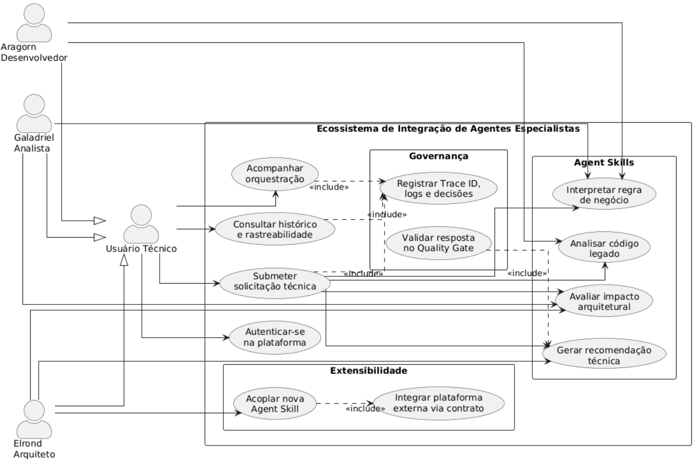

Fonte: Elaborado pela autora (2026).

## 

## 2.2 Requisitos Funcionais (RF)

Os requisitos funcionais definem as capacidades operacionais esperadas
da arquitetura. Eles descrevem como o sistema deve receber solicitações,
orientar a interação, orquestrar agentes especialistas, permitir
acoplamento de novas capacidades, validar respostas e registrar o fluxo
completo para fins de auditoria.

Tabela 2: Requisitos Funcionais

|  |  |
|:--:|:--:|
| **ID** | **Requisito** |
| RF01 | O sistema deve permitir que o usuário técnico crie uma Agent Skills por meio de formulário próprio ou a partir de um arquivo modelo.md, informando nome, descrição, domínio de atuação, capacidades, entradas esperadas, saídas geradas e limites de uso. |
| RF02 | O sistema deve permitir a importação de uma Agent Skills existente por meio do envio de um manifesto compatível, possibilitando que agentes previamente definidos sejam incorporados ao ecossistema. |
| RF03 | O sistema deve validar automaticamente o manifesto da Agent Skills antes de permitir seu registro, verificando se os campos obrigatórios, contratos de entrada e saída, domínio, versão e limites de atuação foram informados corretamente. |
| RF04 | O sistema deve registrar no catálogo apenas as Agent Skills aprovadas na etapa de validação, armazenando suas informações principais, status, versão, domínio de atuação e contratos associados. |
| RF05 | O sistema deve permitir que novas Agent Skills sejam acopladas ao ecossistema sem exigir alteração direta no núcleo da aplicação, desde que respeitem os contratos técnicos previamente definidos. |
| RF06 | O sistema deve permitir que o usuário técnico submeta uma solicitação contendo o problema a ser analisado, o objetivo da análise, o contexto técnico, os artefatos disponíveis e eventuais restrições do cenário. |
| RF07 | O sistema deve solicitar complementação de contexto ao usuário quando a solicitação inicial apresentar informações insuficientes, ambíguas ou incompatíveis com os requisitos mínimos definidos para o fluxo de análise. |
| RF08 | O sistema deve orquestrar a execução multi-agente, coordenando a atuação de diferentes Agent Skills em um mesmo fluxo de análise, conforme o tipo de solicitação recebida. |
| RF09 | O Orquestrador deve selecionar as Agent Skills mais adequadas para cada solicitação com base no domínio de atuação, nas capacidades declaradas, nos contratos disponíveis e no objetivo da análise. |
| RF10 | O Orquestrador deve delegar sub tarefas específicas para as Agent Skills selecionadas, garantindo que cada agente atue apenas dentro do escopo definido em seu manifesto. |
| RF11 | O sistema deve validar as respostas geradas pelas Agent Skills por meio do Advisory Agent ou Quality Gate, verificando consistência, completude, aderência ao contexto e possíveis conflitos entre as análises. |
| RF12 | O sistema deve exibir ao usuário o fluxo de colaboração realizado, apresentando quais agentes foram acionados, quais etapas foram executadas e como as respostas parciais contribuíram para a resposta consolidada. |
| RF13 | O sistema deve registrar logs e informações de auditoria sobre as solicitações, agentes acionados, decisões intermediárias, respostas geradas, validações realizadas e eventuais falhas ocorridas no fluxo. |
| RF14 | O sistema deve tratar falhas e exceções durante a execução, apresentando mensagens compreensíveis ao usuário e registrando os erros para análise posterior e melhoria da governança do ecossistema. |
| RF15 | O sistema deve permitir que usuários autorizados consultem o histórico de solicitações, respostas consolidadas, agentes utilizados, decisões registradas e evidências associadas aos fluxos anteriores. |
| RF16 | O sistema deve permitir que usuários autorizados habilitem ou desabilitem Agent Skills no catálogo, controlando quais agentes estarão disponíveis para uso nos fluxos de orquestração. |

## 

## 2.3 Requisitos Não Funcionais (RNF)

Os requisitos não funcionais estabelecem restrições arquiteturais,
critérios de qualidade e propriedades esperadas da solução. Como o foco
do projeto é a arquitetura da plataforma, esses requisitos priorizam
extensibilidade, interoperabilidade, rastreabilidade, segurança,
desempenho e governança. Na Tabela 3 são apresentados os requisitos não
funcionais da solução.

Tabela 3: Requisitos Não Funcionais

|  |  |
|:--:|:--:|
| **ID** | **Requisito** |
| RNF01 | A arquitetura deve ser extensível, permitindo a inclusão de novas Agent Skills por meio de contratos padronizados, sem necessidade de alteração direta no núcleo do sistema. |
| RNF02 | A comunicação entre os componentes da solução deve ocorrer por meio de contratos formais, contendo entradas esperadas, saídas permitidas, metadados de execução, critérios de validação e limites de atuação. |
| RNF03 | Toda Agent Skill deve passar por validação obrigatória antes de ser habilitada no ecossistema, garantindo que seu manifesto esteja completo, coerente e aderente às regras da plataforma. |
| RNF04 | Os componentes da arquitetura devem possuir baixo acoplamento, permitindo que interface, orquestrador, catálogo, agentes, camada de validação e mecanismos de auditoria evoluam de forma independente. |
| RNF05 | A solução deve permitir crescimento incremental, possibilitando a inclusão futura de novos agentes, domínios técnicos, integrações externas e capacidades especializadas sem comprometer a estrutura principal da arquitetura. |
| RNF06 | O sistema deve manter auditoria completa dos fluxos executados, registrando solicitações, agentes acionados, decisões intermediárias, respostas parciais, validações e resposta final entregue ao usuário. |
| RNF07 | A Prova de Conceito deve buscar tempo médio de resposta de até 10 segundos em cenários controlados, considerando fluxos de análise compatíveis com o escopo definido para validação do protótipo. |
| RNF08 | O sistema deve possuir controle de acesso, restringindo funcionalidades administrativas, como habilitação, desabilitação e registro de Agent Skills, apenas a usuários autorizados. |
| RNF09 | A solução deve atender a critérios de governança e privacidade, evitando exposição indevida de dados sensíveis e limitando o uso das informações aos objetivos definidos no fluxo de análise. |
| RNF10 | A arquitetura deve oferecer mecanismos de observabilidade, permitindo acompanhar status de execução, falhas, logs, rastreabilidade das decisões e comportamento dos agentes durante os fluxos processados. |
| RNF11 | A PoC deve permanecer disponível durante os períodos planejados de teste e validação, garantindo que os fluxos principais possam ser executados e avaliados conforme os critérios definidos no projeto. |

## 

## 2.4 Regras de Negócio

As regras de negócio estabelecem as fronteiras de atuação, governança,
segurança e responsabilidade da arquitetura. Elas garantem que a
delegação para múltiplos agentes ocorra de forma controlada, auditável e
compatível com o uso corporativo de inteligência artificial.

Tabela 4: Regras de Negócio

|  |  |
|:--:|:--:|
| **ID** | **Regra** |
| RN01 | Os agentes devem atuar apenas de forma consultiva, podendo analisar informações, gerar recomendações, apontar riscos e sugerir alternativas, mas sem executar alterações diretamente em código-fonte, bancos de dados, pipelines, ambientes produtivos ou sistemas corporativos. |
| RN02 | A decisão final sobre qualquer alteração técnica, funcional ou arquitetural deve permanecer sob responsabilidade de um profissional humano autorizado, cabendo ao sistema apenas apoiar a análise e a tomada de decisão. |
| RN03 | As respostas geradas pelo ecossistema devem ser justificadas por evidências, indicando o contexto utilizado, os agentes acionados, as principais conclusões e as limitações da análise realizada. |
| RN04 | Nenhuma Agent Skill deve ser habilitada para uso sem a validação prévia de seu manifesto, garantindo que domínio, capacidades, contratos e limites estejam corretamente definidos. |
| RN05 | Toda solicitação técnica deve conter um contexto mínimo obrigatório para ser processada, incluindo objetivo da análise, descrição do problema e informações suficientes para orientar a atuação dos agentes. |
| RN06 | A resposta consolidada deve passar por uma etapa de quality gate antes de ser entregue ao usuário, permitindo identificar inconsistências, lacunas, conflitos ou baixa confiança nas análises geradas. |
| RN07 | Dados sensíveis, confidenciais ou fora do escopo autorizado não devem ser utilizados pelos agentes sem controle adequado, devendo o sistema aplicar restrições de governança e privacidade durante o fluxo. |
| RN08 | O sistema deve limitar o número de iterações entre agentes em um mesmo fluxo, evitando ciclos indefinidos, consumo excessivo de recursos e perda de controle sobre a execução. |
| RN09 | Toda integração com Agent Skills, serviços externos ou fontes de contexto deve ocorrer por meio de contratos padronizados, garantindo previsibilidade, interoperabilidade e rastreabilidade. |
| RN10 | As decisões relevantes tomadas durante o fluxo de orquestração devem ser registradas, incluindo seleção de agentes, validações, rejeições, ajustes solicitados e justificativas associadas. |
| RN11 | A arquitetura deve manter separação clara de responsabilidades entre usuário técnico, Orientador de Interação, Orquestrador, Agent Skills, Advisory Agent, catálogo e camada de auditoria. |
| RN12 | O ciclo de vida de cada Agent Skill deve ser controlado pelo sistema, contemplando criação, importação, validação, registro, habilitação, desabilitação, versionamento e eventual substituição da skill. |

## 

## 2.5 Fora do Escopo

Para delimitar o desenvolvimento e a validação da Prova de Conceito
(PoC), este trabalho não contempla:

- **Substituição da autoridade humana:** a arquitetura atua como suporte
  cognitivo, mecanismo de orquestração e apoio à análise técnica. A
  tomada de decisão final sobre implementações sistêmicas críticas
  permanece sob responsabilidade dos especialistas humanos.

- **Automação de CI/CD e execução direta:** o ecossistema não realiza
  deploys automáticos, aprovação de Pull Requests, alterações diretas em
  código-fonte, execução de scripts em produção ou modificações ativas
  em bancos de dados corporativos.

- **Criação de um agente universal:** o objetivo do projeto não é
  desenvolver um agente artificial capaz de resolver qualquer tipo de
  problema, mas propor uma arquitetura extensível que permita acoplar
  agentes especialistas conforme domínios e contratos definidos.

- **Garantia de eliminação total de alucinações:** embora a arquitetura
  possua mecanismos de orientação, validação cruzada, quality gate e
  rastreabilidade, o escopo não prevê eliminação absoluta de erros
  inferenciais, por se tratar de uma limitação inerente ao uso de
  modelos de linguagem.

- **Cobertura universal de tecnologias na PoC:** a validação será
  realizada sobre um conjunto restrito de domínios técnicos, suficiente
  para demonstrar a viabilidade arquitetural. A inclusão de outras
  linguagens, plataformas, tecnologias ou sistemas deverá ocorrer
  incrementalmente por meio do acoplamento futuro de novas Agent Skills.

- **Treinamento de modelos próprios de linguagem:** o projeto não tem
  como foco treinar um LLM proprietário. A proposta concentra-se na
  arquitetura de integração, orquestração, orientação e governança de
  agentes especialistas, podendo utilizar modelos ou serviços existentes
  na composição da PoC.

- **Substituição de ferramentas corporativas existentes:** a solução não
  pretende substituir IDEs, repositórios, documentações, esteiras de
  CI/CD, ferramentas de gestão ou plataformas corporativas. O objetivo é
  integrar e coordenar capacidades especializadas em torno de uma
  arquitetura comum.

# 

# 3. Arquitetura da Solução

A arquitetura proposta foi desenhada para transformar a análise técnica
de ecossistemas corporativos complexos em uma linha de trabalho
contínua, integrada, extensível e auditável. Afastando-se de abordagens
baseadas em prompts monolíticos, assistentes isolados ou pipelines
lineares rígidos, a solução estrutura-se como um ambiente arquitetural
plug-and-play para importação, registro, orquestração, orientação,
validação e auditoria de agentes especialistas.

O foco da solução não está apenas na execução de tarefas por agentes
artificiais, mas na definição de uma base arquitetural capaz de
comportar diferentes especialistas de forma modular. Cada agente, ou
Agent Skill, é tratado como um componente acoplável, com
responsabilidade específica, contrato de comunicação definido e
rastreabilidade sobre suas entradas, saídas e decisões.

Dessa forma, a arquitetura organiza o ecossistema em camadas com
responsabilidades bem definidas: interface de interação com o usuário
técnico, Orientador de Interação, Orquestrador, Registro de Agent
Skills, Camada de Contratos, Agentes Especialistas, Validador/Quality
Gate, mecanismos de observabilidade e adaptadores para integrações
externas.

## 

## 3.1 Visão Geral e Fundamentos

O ecossistema fundamenta-se na coordenação estruturada de agentes
especialistas artificiais que operam sobre domínios de conhecimento
historicamente fragmentados, como código legado, regras de negócio,
arquitetura corporativa, integrações, APIs e documentação técnica.

A principal proposta de valor reside no caráter plug-and-play da
arquitetura. O núcleo da solução foi concebido para receber novos
agentes e integrar novas capacidades de forma dinâmica, permitindo a
expansão contínua do escopo analítico da plataforma sem exigir
refatoração do core do sistema. Assim, quando uma nova tecnologia, regra
de negócio ou necessidade corporativa surge, a organização pode acoplar
uma nova Agent Skill ao ambiente por meio de contratos padronizados.

O conceito de agentes de software é amplamente discutido na literatura
de Inteligência Artificial e Sistemas Distribuídos. Em linhas gerais,
agentes são entidades capazes de perceber um contexto, processar
informações e atuar orientadas a objetivos. No contexto de sistemas
multiagentes, diferentes entidades autônomas ou semi autônomas podem
colaborar para resolver problemas complexos que dificilmente seriam
tratados por um único componente. Neste trabalho, esses conceitos são
aplicados à construção de uma arquitetura corporativa capaz de coordenar
especialistas artificiais voltados a domínios específicos de
conhecimento.

Essa arquitetura extensível é sustentada por cinco pilares fundamentais:

**1. Engenharia de Contexto Estruturada:** o contexto deixa de ser
tratado como texto livre e passa a ser organizado como um ativo
estruturado, composto por informações mínimas obrigatórias, artefatos
relacionados, restrições, objetivo da análise e metadados de
rastreabilidade. Sempre que o contexto for insuficiente, o Orientador de
Interação deve solicitar complementos antes que a demanda seja
encaminhada aos agentes especialistas.

**2. Orientação da Interação:** o sistema possui um componente
responsável por conduzir a interação entre usuário técnico, orquestrador
e agentes. Esse Orientador de Interação atua na qualificação da demanda,
identificação de lacunas, normalização do contexto, aplicação de regras
de governança e preservação da coerência do fluxo até a resposta final.

**3. Orquestração Inteligente:** em vez de chamadas isoladas a modelos
de linguagem, o sistema adota um fluxo multi-agente estruturado. O
Orquestrador interpreta a demanda qualificada, decompõe o problema em
subtarefas, seleciona as Agent Skills adequadas, coordena a execução e
encaminha respostas parciais para consolidação e validação.

**4. Capacidades Modulares:** os agentes especialistas são encapsulados
como módulos independentes e reutilizáveis. Cada Agent Skill possui uma
finalidade específica, como análise de código legado, interpretação de
regra de negócio, análise de impacto, recomendação arquitetural ou
avaliação de contratos de integração.

**5. Extensibilidade Externa e Desacoplamento:** a arquitetura prevê
interfaces padronizadas e adaptadores agnósticos para integração com
plataformas externas, serviços de IA, bases de conhecimento e
foundations corporativas. Essa abordagem reduz a dependência
tecnológica, favorece a interoperabilidade e permite evolução
incremental do ecossistema.

Para a representação e documentação estrutural da arquitetura, adota-se
o C4 Model. A Figura 2 apresenta a visão macro da solução por meio do
Diagrama de Contexto, correspondente ao C4 Model — Nível 1. O diagrama
evidencia o posicionamento do ecossistema em relação aos usuários
técnicos, às bases de conhecimento corporativo, às plataformas externas
de agentes, ao código legado e às documentações e APIs utilizadas como
fontes de contexto.

Figura 2: Diagrama de contexto da arquitetura proposta (C4 – Nível 1)

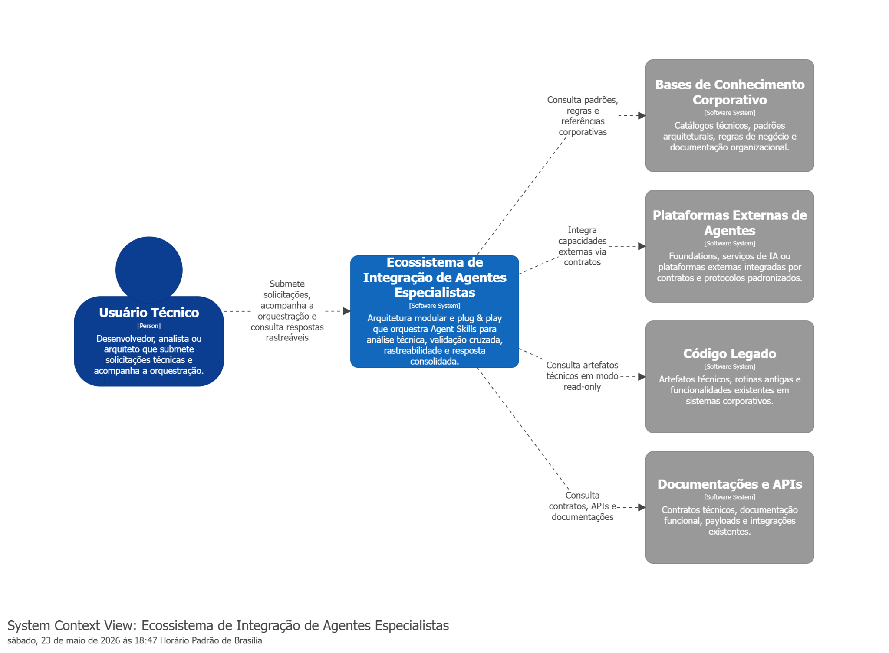

Fonte: Elaborado pela autora (2026).

## 

## 3.2 Estrutura Arquitetural e Papéis

A arquitetura organiza o ecossistema separando explicitamente as
responsabilidades de interação, coordenação, execução especializada,
validação e rastreabilidade. Essa separação evita que um único
componente acumule todas as decisões do fluxo e favorece modularidade,
governança e auditoria.

A solução adota comunicação orientada a contratos entre seus
componentes. Esses contratos definem entradas esperadas, saídas
permitidas, metadados de execução, critérios de validação e limites de
atuação. Protocolos como o Model Context Protocol (MCP) podem ser
utilizados como referência para padronizar a comunicação entre agentes,
ferramentas, serviços externos e fontes de contexto.

No Quadro 3 é apresentada a matriz de responsabilidades dos componentes
especializados da solução, com a descrição do papel de cada elemento
dentro da arquitetura.

Quadro 3: Matriz de Responsabilidades dos Componentes Especializados

|  |  |
|:--:|:--:|
| **Componente** | **Responsabilidade Principal** |
| **Interface Técnica** | Permitir criação/importação de agentes, envio de solicitações, acompanhamento de fluxos e consulta de resultados. |
| **Agent Builder** | Auxiliar a criação de novas Agent Skills e geração do manifesto modelo.md. |
| **Importador de Agentes** | Receber arquivos modelo.md, extrair informações e iniciar validação. |
| **Validador de Manifesto** | Verificar estrutura, domínio, capacidades, contratos e limites do agente. |
| **Catálogo de Agent Skills** | Registrar agentes disponíveis, versões, domínios, contratos e status. |
| **Orientador de Interação** | Validar contexto inicial, solicitar complementos e preparar demandas para o Orquestrador. |
| **Orquestrador** | Selecionar agentes, dividir tarefas, coordenar execução e consolidar resultados. |
| **Camada de Contratos** | Padronizar comunicação entre componentes e validar entradas e saídas. |
| **Agent Skill de Legado** | Analisar sistemas antigos, dependências e regras implícitas. |
| **Agent Skill de Negócio** | Interpretar regras funcionais, processos e requisitos de negócio. |
| **Agent Skill de Arquitetura** | Avaliar impactos técnicos, padrões arquiteturais e riscos estruturais. |
| **Agent Skill de Integração** | Analisar APIs, contratos, integrações e compatibilidade de dados. |
| **Advisory Agent / Quality Gate** | Validar respostas, identificar inconsistências e aprovar ou rejeitar resultados. |
| **Logs e Auditoria** | Registrar interações, decisões, agentes acionados e histórico de execução. |
| **Adaptador Plug-and-Play** | Integrar novas Agent Skills e plataformas externas sem alterar o núcleo. |

Para compreender a topologia dos componentes, suas fronteiras de
responsabilidade e os fluxos de comunicação entre interface, Orientador
de Interação, Orquestrador, Agent Skills, camada de validação e
integrações externas, a Figura 3 apresenta o Diagrama de Contêineres da
arquitetura proposta, correspondente ao C4 Model — Nível 2.

> Figura 3: Diagrama de contêineres da arquitetura proposta (C4 – Nível
> 2)

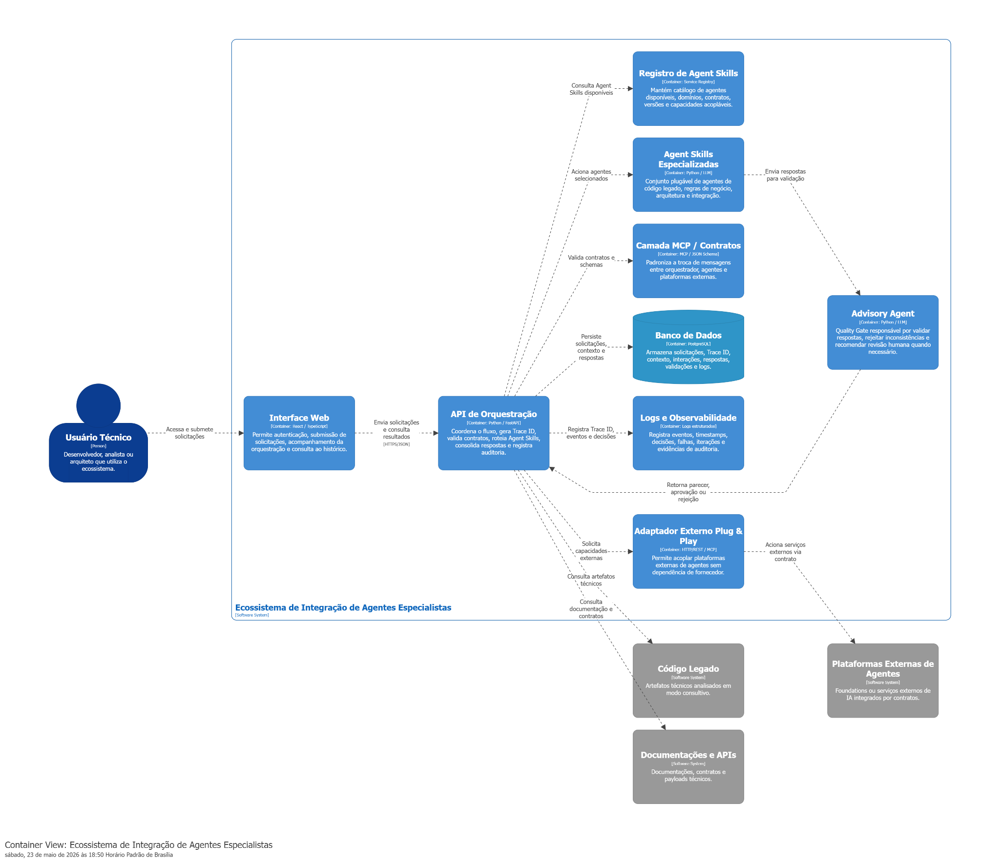

Fonte: Elaborado pela autora (2026).

## 

## 3.3 Fluxo Cognitivo e Operacional

A dinâmica interna do sistema afasta-se de pipelines lineares e se
aproxima de fluxos agênticos estruturados. O processamento ocorre por
etapas controladas, nas quais o contexto é qualificado, o problema é
decomposto, os agentes são acionados conforme suas capacidades e a
resposta final é validada antes de ser entregue ao usuário.

O fluxo cognitivo e operacional pode ser compreendido em sete etapas
principais:

**1. Submissão da solicitação:** o usuário técnico informa o problema,
objetivo da análise, artefatos disponíveis, restrições e contexto
inicial.

**2. Orientação e qualificação do contexto:** o Orientador de Interação
avalia se a solicitação possui informações mínimas para processamento.
Caso existam lacunas, ambiguidades ou ausência de artefatos essenciais,
o sistema solicita complementos ao usuário antes de acionar os agentes
especialistas.

**3. Planejamento da orquestração:** o Orquestrador recebe a demanda
qualificada, decompõe o problema em subtarefas e define quais Agent
Skills devem ser acionadas, considerando domínio, contrato, capacidade
declarada e objetivo da análise.

**4. Execução especializada:** os agentes selecionados executam suas
análises dentro dos limites definidos por seus contratos e escopos de
atuação. Cada resposta parcial é registrada com metadados, origem,
status e nível de confiança.

**5. Consolidação técnica:** o Orquestrador reúne as respostas parciais,
identifica complementaridades, conflitos ou lacunas e estrutura uma
resposta consolidada preliminar.

**6. Validação e quality gate:** o Advisory Agent ou módulo validador
revisa a resposta consolidada, verifica aderência a padrões técnicos,
identifica inconsistências, sinaliza baixa confiança e aprova, rejeita
ou solicita ajustes no fluxo.

**7. Entrega e rastreabilidade:** a resposta final é apresentada ao
usuário juntamente com justificativas, agentes acionados, decisões
tomadas, limitações da análise e histórico do fluxo executado.

A decomposição interna dos módulos que viabilizam essa lógica está
representada na Figura 4, correspondente ao Diagrama de Componentes da
API de Orquestração (C4 – Nível 3).

> Figura 4: Diagrama de componentes da API de orquestração (C4 – Nível
> 3)

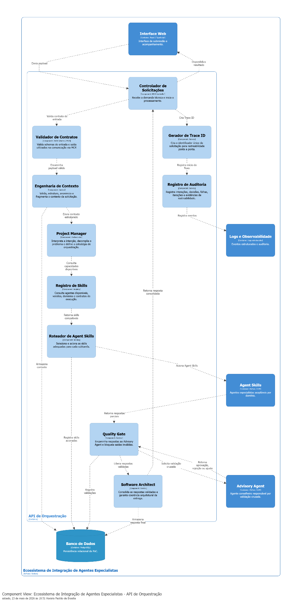

Fonte: Elaborado pela autora (2026).

A Figura 5 ilustra o fluxo principal de processamento da solicitação
técnica. A partir da entrada do usuário, o sistema qualifica o contexto
por meio do Orientador de Interação, define a estratégia de
orquestração, aciona as Agent Skills adequadas, consolida respostas
parciais, executa validação transversal e registra todo o processo para
rastreabilidade corporativa.

Figura 5: Fluxo principal de processamento

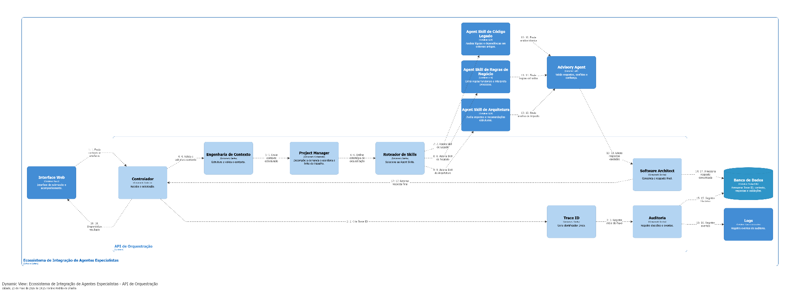

Fonte: Elaborado pela autora (2026).

**3.3.1 Tratamento de Exceções e Fluxos Alternativos**

A implantação de uma arquitetura corporativa baseada em múltiplos
agentes exige previsão e tratamento rigoroso de falhas cognitivas,
falhas de contrato, ausência de contexto, divergência de respostas e
indisponibilidade de componentes. Por isso, o fluxo operacional deve
possuir mecanismos explícitos de fallback, evitando que respostas
inconsistentes ou não auditáveis sejam entregues ao usuário final.

A Tabela 5 apresenta os principais cenários de exceção e os respectivos
mecanismos de tratamento.

Tabela 5: Mapeamento de Exceções e Resiliência

|  |  |
|:--:|:--:|
| **Situação** | **Tratamento** |
| **Manifesto modelo.md incompleto** | Rejeitar cadastro, informar campos pendentes e solicitar correção. |
| **Agente sem domínio definido** | Bloquear ativação até que o domínio e responsabilidade estejam definidos. |
| **Contexto insuficiente** | O orientador solicita informações adicionais antes da execução. |
| **Respostas divergentes entre agentes** | Encaminhar conflito ao Advisory Agent para validação. |
| **Falha de contrato ou schema** | Rejeitar mensagem inválida e registrar ocorrência. |
| **Baixa confiança da resposta** | Sinalizar resultado e solicitar revisão ou validação humana. |
| **Agent Skill indisponível** | Buscar alternativas ou informar indisponibilidade ao usuário. |
| **Violação de governança** | Bloquear a ação fora do escopo permitido e registrar evento. |
| **Excesso de iterações** | Encerrar fluxo e encaminhar para análise humana. |

A representação visual dos fluxos alternativos, demonstrando os desvios
arquiteturais em cenários de falha, encontra-se detalhada no Apêndice D.

## 

## 3.4 Princípios e Alinhamento ao SDD

Para assegurar que a solução transcenda a categoria de assistente
virtual e opere como uma arquitetura corporativa de integração
multi-agente, a fundação arquitetural é orientada pelos princípios do
Spec-Driven Development (SDD).

Nesse contexto, a especificação deixa de ser apenas documentação
auxiliar e passa a orientar o comportamento do sistema. As interações
entre usuário, Orientador, Orquestrador, agentes especialistas,
validadores e integrações externas são delimitadas por contratos,
schemas, regras de negócio, critérios de validação e registros de
rastreabilidade.

O alinhamento ao SDD ocorre por meio dos seguintes princípios:

- **Demanda técnica como especificação:** a solicitação do usuário é
  tratada como um objeto estruturado, composto por objetivo, contexto,
  artefatos, restrições, domínio envolvido e expectativa de saída.

- **Contratos explícitos entre componentes:** cada agente e componente
  do ecossistema deve possuir entradas, saídas, responsabilidades e
  limites definidos, reduzindo ambiguidades e tornando a integração
  previsível.

- **Separação de responsabilidades:** o Orientador conduz a interação, o
  Orquestrador coordena o fluxo, as Agent Skills executam análises
  especializadas e o Advisory Agent valida a qualidade final. Essa
  separação reduz o acoplamento e melhora a governança.

- **Rastreabilidade por design:** cada etapa do fluxo deve gerar
  registros que permitam identificar quais agentes foram acionados,
  quais decisões foram tomadas, quais contratos foram utilizados e quais
  validações foram aplicadas.

- **Evolução incremental:** novas Agent Skills podem ser adicionadas ao
  ecossistema por meio de contratos padronizados, sem exigir
  reestruturação do core de orquestração.

Essa base contratual viabiliza a escalabilidade da solução. Ao tratar
agentes como componentes importáveis e governados por especificações, a
arquitetura permite que novos domínios tecnológicos, especialistas
artificiais e integrações externas sejam adicionados progressivamente à
linha de trabalho corporativa, mantendo coerência, controle e
auditabilidade.

# 

# 4. Mockups e Experiência do Usuário (UX)

A experiência do usuário foi planejada para tornar visível a operação da
arquitetura de integração de agentes especialistas. Como a proposta não
se limita a um assistente conversacional, a interface deve permitir que
o usuário técnico acompanhe a submissão da demanda, a orientação do
contexto, a orquestração dos agentes, a validação das respostas e a
rastreabilidade das decisões geradas durante o fluxo.

Dessa forma, a interface atua como uma espécie de painel de controle do
ecossistema multi-agente, permitindo que desenvolvedores, analistas,
arquitetos e responsáveis técnicos compreendam não apenas a resposta
final entregue pelo sistema, mas também o caminho percorrido pela
arquitetura para produzi-la.

## 

## 4.1 Visão Geral e Fluxo de Navegação

A interface do usuário atua como o painel de controle da arquitetura
plug-and-play de agentes especialistas. Considerando que o sistema é
voltado a um público técnico, formado por desenvolvedores, analistas,
arquitetos e responsáveis pela plataforma, a experiência prioriza
clareza, objetividade, rastreabilidade e transparência operacional.

A experiência não visa apenas permitir que o usuário envie uma pergunta
ou descreva um problema, como ocorreria em um chatbot convencional. O
objetivo é tornar observável o funcionamento da arquitetura: como o
contexto é orientado, como o problema é decomposto, quais Agent Skills
foram acionadas, quais respostas parciais foram produzidas, como ocorreu
a validação e qual resultado final foi aprovado pelo mecanismo de
quality gate.

O fluxo de navegação foi desenhado para ser linear, previsível e
compatível com o público técnico da solução. O usuário inicia pela
autenticação, acessa uma visão geral do ecossistema, cria uma nova
solicitação técnica, acompanha a orquestração dos agentes, consulta a
resposta consolidada e, posteriormente, pode auditar o histórico de
decisões.

A sequência principal de navegação contempla as seguintes etapas:

1.  **Login:** autenticação do usuário técnico autorizado.

2.  **Dashboard:** visão geral do ecossistema, solicitações recentes,
    status das análises e Agent Skills disponíveis.

3.  **Nova Solicitação Técnica:** cadastro estruturado do problema,
    contexto, artefatos e restrições.

4.  **Orientação de Contexto:** validação inicial da solicitação, com
    possibilidade de pedido de complemento pelo Orientador de Interação.

5.  **Acompanhamento da Orquestração:** visualização do fluxo
    multiagente, agentes acionados, etapas concluídas e validações em
    andamento.

6.  **Resposta Consolidada:** apresentação da análise final aprovada,
    com recomendações, riscos, justificativas e limitações.

7.  **Histórico e Rastreabilidade:** consulta posterior às solicitações,
    decisões, agentes acionados, validações e registros de auditoria.

A Figura 6 apresenta o diagrama unificado de fluxo de navegação do
usuário, demonstrando a jornada desde a autenticação até a auditoria das
decisões técnicas registradas.

Figura 6: Diagrama unificado de fluxo de navegação do usuário

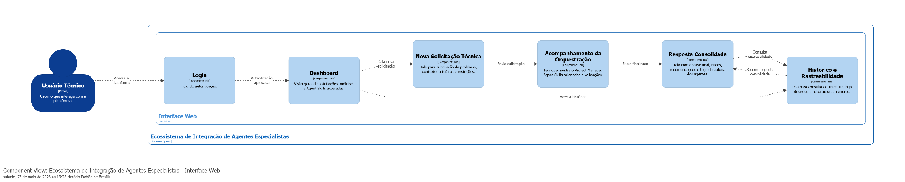

Fonte: Elaborado pela autora (2026).

## 4.2 Estrutura das Interfaces (Wireframes)

Para validar e tangibilizar o fluxo de interação, foram planejados
wireframes das telas principais da aplicação. Considerando o foco
atualizado do projeto, a experiência do usuário passa a priorizar a
criação, importação, validação e integração de Agent Skills ao
ecossistema, antes mesmo da execução de solicitações técnicas.

A interface foi organizada para evitar telas excessivamente carregadas.
Em vez de concentrar muitas informações em um único painel, a
experiência será dividida em etapas objetivas, permitindo que o usuário
compreenda melhor o ciclo de vida de um agente: criação ou importação,
validação do manifesto, registro no catálogo, teste de integração,
participação em fluxos orquestrados e consulta posterior da
rastreabilidade.

Essa decisão de UX reforça a proposta arquitetural do projeto, pois
torna visível o processo plug-and-play de integração de agentes
especialistas. Cada tela deve apresentar apenas as informações
necessárias para a etapa atual, mantendo uma estética tecnológica,
escura, com cards translúcidos, bordas suaves, destaques em gradiente e
indicadores visuais de status.

A Tabela 6 sintetiza o objetivo de cada tela, as principais ações do
usuário e sua relação com o fluxo da plataforma.

Tabela 6: Mapeamento de Telas e Ações do Usuário

|  |  |  |
|:---|:---|:---|
| **Tela** | **Objetivo na Jornada do Usuário** | **Ações Principais** |
| **1. Login** | Garantir acesso restrito ao ecossistema, considerando que a plataforma manipula agentes, contratos, logs e artefatos técnicos. | Autenticar usuário; validar permissões; iniciar sessão segura. |
| **2. Dashboard do Ecossistema** | Apresentar uma visão geral e pouco carregada da saúde da plataforma. | Visualizar agentes ativos, agentes pendentes, execuções recentes, alertas de governança e acesso rápido às principais áreas. |
| **3. Catálogo de Agent Skills** | Exibir os agentes especialistas disponíveis no ecossistema, seus domínios, versões e status. | Consultar Agent Skills; filtrar por domínio ou status; visualizar detalhes; acessar criação ou importação de agente. |
| **4. Criar ou Importar Agente** | Permitir que o usuário crie uma nova Agent Skill ou importe um agente existente por meio de um arquivo modelo.md. | Preencher dados do agente; gerar manifesto; fazer upload do modelo.md; visualizar prévia dos metadados; enviar para validação. |
| **5. Validação e Teste do Agente** | Verificar se o agente criado ou importado atende aos critérios mínimos de governança e se consegue atuar no ecossistema. | Validar manifesto; identificar pendências; testar contrato; executar cenário controlado; aprovar, rejeitar ou solicitar ajustes. |
| **6. Solicitação Técnica e Orquestração** | Permitir que o usuário envie uma demanda técnica e acompanhe a atuação dos agentes selecionados pelo Orquestrador. | Submeter problema, contexto e artefatos; complementar informações solicitadas; acompanhar agentes acionados, etapas executadas e validação em andamento. |
| **7. Resposta Consolidada e Histórico** | Apresentar o resultado final validado e permitir consulta posterior da rastreabilidade. | Consultar resposta consolidada; visualizar agentes participantes; verificar parecer do quality gate; acessar Trace ID, logs e histórico da execução. |

As telas devem seguir uma estrutura visual menos densa, com priorização
das informações essenciais. O uso de cards deve ser controlado, evitando
muitos painéis simultâneos. Sempre que possível, informações secundárias
devem ser exibidas em abas, painéis recolhiveis ou etapas progressivas
do fluxo.

As Figuras E.1 a E.7, que representam os mockups detalhados do fluxo de
autenticação, dashboard, catálogo de agentes, criação de agente,
upload/importação, validação do manifesto, teste de integração, nova
solicitação técnica, orientação de contexto, acompanhamento da
orquestração, resposta consolidada e histórico de rastreabilidade,
encontram-se dispostas no Apêndice E.

## 4.3 Fluxo de Interação do Usuário

O fluxo de interação do usuário foi organizado em dois momentos
principais. O primeiro está relacionado à criação ou importação de Agent
Skills, permitindo que novas capacidades especialistas sejam
incorporadas ao ecossistema. O segundo corresponde ao uso da plataforma
para submissão de solicitações técnicas, nas quais o sistema qualifica o
contexto informado, orquestra os agentes adequados, valida as respostas
geradas e apresenta uma resposta consolidada ao usuário.

No fluxo de criação ou importação de Agent Skills, o usuário acessa o
catálogo da plataforma e pode cadastrar uma nova skill por meio de
formulário ou importar um manifesto modelo.md. Após o envio, o sistema
valida as informações do manifesto, verificando se os campos
obrigatórios, o domínio de atuação, as capacidades, os contratos e os
limites de uso foram definidos corretamente. Caso sejam encontradas
inconsistências, o usuário deve ajustar as informações antes de
prosseguir. Quando a validação é aprovada, a skill é registrada no
catálogo e fica disponível para uso nos fluxos de orquestração.

A Figura 7 apresenta o fluxo de criação ou importação de Agent Skill,
evidenciando as etapas de envio, validação, correção e registro da skill
no catálogo da plataforma.

> Figura 7: Fluxo de criação ou importação de Agent Skill

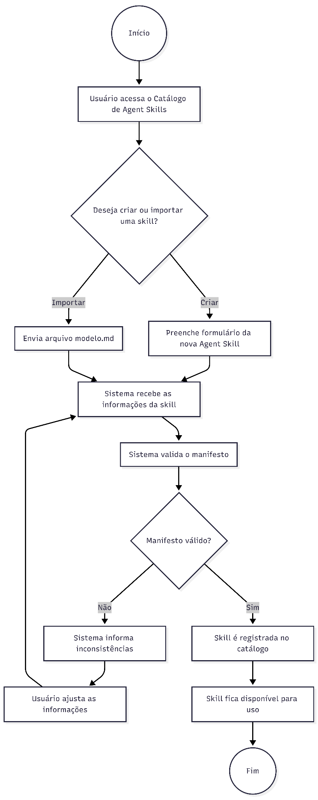

Fonte: Elaborado pela autora (2026).

No fluxo de solicitação técnica, o usuário informa o problema a ser
analisado, o objetivo da solicitação e o contexto disponível. Antes de
acionar os agentes especialistas, o sistema verifica se as informações
fornecidas são suficientes. Caso o contexto esteja incompleto ou
ambíguo, o usuário deve complementar os dados solicitados. Com o
contexto qualificado, o Orquestrador seleciona as Agent Skills
adequadas, coordena a execução das análises e consolida as respostas
parciais.

Antes da entrega final, a resposta consolidada passa por uma etapa de
validação realizada pelo Advisory Agent ou Quality Gate. Essa etapa
busca identificar inconsistências, lacunas ou conflitos nas respostas
geradas pelos agentes. Após a aprovação, o sistema apresenta ao usuário
a resposta final, acompanhada das justificativas e da rastreabilidade do
fluxo executado.

A Figura 8 apresenta o fluxo de solicitação técnica do usuário,
contemplando as etapas de envio da demanda, qualificação do contexto,
orquestração dos agentes, validação da resposta e apresentação do
resultado consolidado.

> Figura 8: Fluxo de solicitação técnica e orquestração multiagente

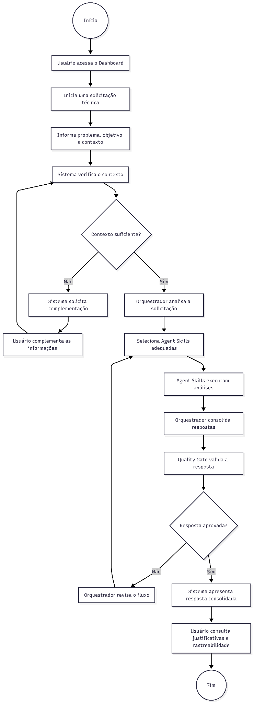

Fonte: Elaborado pela autora (2026).

## 

## 4.4 Diretrizes Visuais e Redução de Carga Cognitiva

Para manter a interface alinhada à estética proposta, mas menos
carregada, as telas deverão seguir diretrizes de redução de carga
cognitiva. O objetivo é preservar a identidade visual tecnológica do
projeto sem comprometer a clareza da navegação e da leitura.

As principais diretrizes são:

- **Separação por etapas:** cada tela deve resolver uma etapa específica
  do fluxo, evitando concentrar criação, validação, logs, resposta e
  histórico no mesmo espaço visual.

- **Cards com função clara:** os cards devem ser utilizados para agrupar
  informações relevantes, mas em quantidade reduzida. Cada card deve
  possuir título objetivo, descrição curta e ação principal visível.

- **Hierarquia visual:** informações críticas, como status do agente,
  validação do manifesto e falhas de contrato, devem ter destaque maior
  que dados secundários.

- **Uso moderado de métricas:** o dashboard deve apresentar poucos
  indicadores essenciais, evitando excesso de números e painéis
  simultâneos.

- **Abas ou seções recolhíveis:** informações detalhadas, como
  contratos, logs técnicos e respostas parciais, podem ser exibidas em
  abas ou painéis expansíveis, mantendo a tela inicial mais limpa.

- **Status visuais consistentes:** agentes e execuções devem utilizar
  estados padronizados, como pendente, em validação, aprovado,
  rejeitado, ativo, suspenso e concluído.

- **Estética preservada:** a interface deve manter o fundo escuro,
  elementos translúcidos, bordas suaves, gradientes sutis e sensação de
  painel tecnológico, porém com mais espaçamento, menos blocos
  simultâneos e textos mais objetivos.

Com essas diretrizes, a experiência visual permanece coerente com a
identidade do projeto, mas passa a favorecer uma navegação mais simples,
clara e orientada ao fluxo principal da arquitetura.

**4.5 Feedback Inicial de Usuários**

Após a elaboração dos wireframes e do fluxo de interação, foi realizada
uma avaliação inicial qualitativa com usuários representativos dos
perfis contemplados pelo projeto, considerando desenvolvedores,
analistas de sistemas e profissionais com atuação em arquitetura ou
integração de software. O objetivo dessa etapa foi verificar se a
experiência proposta estava coerente com as necessidades do público-alvo
e se as telas permitiam compreender o funcionamento da arquitetura de
agentes especialistas.

A avaliação consistiu na apresentação dos mockups principais da
aplicação, contemplando o fluxo de autenticação, dashboard, catálogo de
Agent Skills, nova solicitação técnica, orientação de contexto,
acompanhamento da orquestração, resposta consolidada e histórico de
rastreabilidade. Durante a análise, foram observados aspectos como
clareza da navegação, facilidade de submissão da solicitação técnica,
compreensão sobre a atuação dos agentes especialistas, utilidade da
resposta consolidada e percepção de valor da rastreabilidade.

De modo geral, os participantes compreenderam a proposta central da
interface e reconheceram valor na possibilidade de acompanhar o processo
de orquestração, em vez de receber apenas uma resposta final sem
explicação do caminho percorrido. A tela de acompanhamento da
orquestração foi percebida como um elemento relevante para dar
transparência ao funcionamento da solução, pois permite visualizar quais
especialistas foram acionados, em que etapa o fluxo se encontra e como a
validação é conduzida.

Também foi destacada a importância da tela de histórico e
rastreabilidade, especialmente para cenários corporativos em que
decisões técnicas precisam ser auditadas, reaproveitadas ou justificadas
posteriormente. A possibilidade de consultar solicitações anteriores,
especialistas acionados, respostas produzidas e registros de validação
foi considerada útil para apoiar a memória técnica do time e reduzir a
dependência de conhecimento concentrado em indivíduos específicos.

Como pontos de melhoria, foram identificadas oportunidades relacionadas
à simplificação da nomenclatura de alguns elementos da interface, ao
reforço visual do status de processamento e à necessidade de deixar mais
explícita a diferença entre resposta parcial dos especialistas e
resposta final consolidada. Também foi observada a importância de
evidenciar melhor quando o sistema está solicitando complemento de
contexto por meio do Orientador de Interação, para que o usuário
compreenda que essa etapa faz parte da governança do fluxo e não
representa uma falha da aplicação.

Assim, o feedback inicial contribuiu para validar a direção geral da
experiência proposta, indicando que os mockups representam de forma
adequada o fluxo principal da solução e que a interface tem potencial
para apoiar usuários técnicos na submissão, acompanhamento e auditoria
de solicitações complexas em uma arquitetura multiagente plug-and-play.

# 

# 5. Modelagem Técnica e Implementação da PoC

Esta seção delimita como os fundamentos arquiteturais definidos na Seção
3 serão implementados em um ambiente controlado por meio de uma Prova de
Conceito (PoC). O objetivo é demonstrar a viabilidade técnica da
arquitetura plug-and-play para integração, orientação, orquestração,
validação e rastreabilidade de agentes especialistas, sem a necessidade
de construir uma plataforma corporativa em escala comercial neste
primeiro momento.

A PoC não tem como foco comprovar a superioridade de um modelo de
linguagem específico, nem desenvolver um agente universal. Seu propósito
é validar a arquitetura proposta: como uma solicitação técnica é
recebida, orientada, decomposta, encaminhada para Agent Skills, validada
por um mecanismo de quality gate e registrada integralmente para
auditoria.

## 

## 5.1 Escopo da Prova de Conceito

Para validar a arquitetura, a PoC não buscará cobrir todos os domínios
possíveis da engenharia de software. O escopo será delimitado a um
caminho feliz representativo: a análise de impacto e documentação
técnica de uma funcionalidade existente em um ecossistema legado.

Nesse cenário, o usuário técnico submete um trecho de código, uma
documentação desatualizada ou uma descrição funcional incompleta. A
partir dessa entrada, o sistema deverá demonstrar a atuação coordenada
dos principais componentes da arquitetura: Orientador de Interação,
Orquestrador, Registro de Agent Skills, Agentes Especialistas, Camada de
Contratos, Validador e mecanismos de rastreabilidade.

A PoC deverá evidenciar os seguintes comportamentos:

- Qualificação inicial do contexto pelo Orientador de Interação;

- Geração de um identificador único de rastreabilidade;

- Decomposição da solicitação em subtarefas;

- Seleção dinâmica de Agent Skills com base no domínio da demanda;

- Execução de análises especializadas;

- Validação cruzada das respostas parciais;

- Consolidação da resposta final;

- Registro completo do fluxo executado.

Tabela 7: Cenário de Validação da PoC

|  |  |
|:--:|:--:|
| **Etapa** | **Resultado Esperado** |
| **Criação ou Importação** | Usuário cria ou envia um agente via modelo.md. |
| **Validação do Manifesto** | Sistema verifica estrutura, contratos e limites. |
| **Registro** | Agent Skill aprovada é adicionada ao catálogo. |
| **Teste Controlado** | Agente executa cenário de validação. |
| **Orquestração** | Orquestrador combina nova skill com agentes existentes. |
| **Execução do Agente** | Nova skill produz resposta dentro do domínio definido. |
| **Validação Final** | Quality Gate avalia qualidade e consistência. |
| **Entrega** | O sistema apresenta resposta consolidada e rastreável. |

Para demonstrar o caráter plug-and-play da arquitetura, a PoC também
deverá prever o acoplamento de ao menos uma nova Agent Skill por meio de
contrato estruturado, sem alteração do núcleo do Orquestrador. Esse
teste permitirá validar a extensibilidade arquitetural prevista nos
requisitos não funcionais.

## 

## 5.2 Conjunto Tecnológico (Stack)

A escolha tecnológica prioriza a construção ágil de uma aplicação
funcional, a manipulação eficiente de dados estruturados, a integração
com modelos de linguagem ou respostas simuladas, e a persistência
relacional necessária para garantir rastreabilidade e auditoria.

A stack proposta busca equilibrar simplicidade de implementação e
aderência ao objetivo arquitetural da PoC. Como o foco está na validação
da arquitetura de orquestração e não na construção de uma infraestrutura
corporativa completa, as tecnologias selecionadas devem permitir
prototipação rápida, observabilidade do fluxo e facilidade de evolução.

Tabela 8: Decisões de Stack Tecnológica

|  |  |  |
|:--:|:--:|:--:|
| **Camada** | **Tecnologia Escolhida** | **Justificativa** |
| **Frontend / UX** | React.js / TypeScript | Permite criar uma Single Page Application (SPA) reativa para dashboard, catálogo de agentes, criação/importação via modelo.md, acompanhamento da orquestração, resposta consolidada e histórico de rastreabilidade. |
| **Backend / API** | Python / Fast API | Oferece boa performance para APIs, facilidade de manipulação de JSON, suporte a processamento assíncrono e integração natural com bibliotecas relacionadas a IA e automação de fluxos. |
| **Agent Builder** | Serviço lógico no backend | Responsável por auxiliar a criação de novas Agent Skills e gerar uma estrutura compatível com o arquivo modelo.md. |
| **Importador de Agentes** | Serviço lógico no backend | Responsável por receber, interpretar e encaminhar arquivos modelo.md para validação estrutural antes do registro da skill no ecossistema. |
| **Validador de Manifesto** | Camada própria em Python | Verifica se o agente criado ou importado possui estrutura mínima, contratos, domínio de atuação, capacidades declaradas e limites de atuação. |
| **Motor de Orquestração** | Camada própria em Python | Implementa a lógica de decomposição da demanda, seleção de Agent Skills, controle de etapas, tratamento de falhas, consolidação de respostas e aplicação dos contratos da arquitetura. |
| **Orientador de Interação** | Serviço lógico no backend | Responsável por validar o contexto inicial, solicitar complementos, normalizar demandas e impedir que solicitações incompletas sejam encaminhadas diretamente aos agentes. |
| **Agent Skills** | Módulos independentes em Python | Representam especialistas artificiais acopláveis, cada um com contrato, domínio de atuação e formato de resposta específico. Na PoC, podem operar com LLMs, prompts controlados, respostas simuladas ou regras fixas. |
| **Banco de Dados** | PostgreSQL | Garante armazenamento relacional robusto para usuários, agentes, versões, contratos, manifestos, logs, respostas parciais, validações e respostas finais. |
| **Comunicação e Contratos** | HTTP/REST, JSON Schemas e contratos inspirados em MCP | Padroniza a comunicação entre frontend, backend, Orquestrador, Agent Skills e camada de validação, reduzindo acoplamento e permitindo evolução plug-and-play. |
| **Observabilidade** | Logs estruturados e painel de acompanhamento | Permite registrar tempo de execução, agentes acionados, falhas, validações, status do fluxo e eventos relevantes para auditoria técnica. |

A escolha por uma camada própria de orquestração permite que a PoC
mantenha controle explícito sobre as decisões arquiteturais, evitando
dependência excessiva de frameworks prontos. Dessa forma, o protótipo
consegue demonstrar a lógica central da pesquisa: a arquitetura como
elemento principal de integração e governança dos agentes.

## 

## 5.3 Modelo de Dados

Como a governança é um pilar estrutural da solução, o banco de dados
relacional será modelado para garantir que a resposta final nunca perca
o vínculo de rastreabilidade com a solicitação original, com os agentes
acionados, com as respostas parciais e com as validações realizadas.

O modelo de dados da PoC deverá permitir reconstruir todo o caminho
percorrido por uma solicitação, desde a entrada do usuário até a
resposta final. Para isso, as entidades principais serão organizadas em
torno do Trace ID, identificador único responsável por agrupar todas as
etapas de uma execução.

As principais entidades previstas são:

- **Solicitação Técnica:** entidade central do fluxo. Armazena o
  identificador da solicitação, usuário responsável, objetivo da
  análise, status atual, data de criação, data de atualização e Trace ID
  associado.

- **Contexto da Solicitação:** armazena o payload inicial submetido pelo
  usuário, os artefatos relacionados, às restrições informadas e
  eventuais complementos solicitados pelo Orientador de Interação.

- **Agent Skill:** representa os agentes especialistas disponíveis no
  ecossistema, contendo nome, domínio de atuação, descrição, versão,
  status, tipo de skill e endpoint ou módulo responsável pela execução.

- **Contrato da Skill:** define o formato esperado de entrada e saída de
  cada Agent Skill, incluindo schema, campos obrigatórios, restrições,
  versão do contrato e critérios mínimos de validação.

- **Etapa de Orquestração:** registra cada passo executado pelo
  Orquestrador, incluindo subtarefa gerada, skill selecionada, ordem de
  execução, status, tempo de início, tempo de fim e eventuais falhas.

- **Resposta Parcial:** armazena os outputs individuais produzidos por
  cada Agent Skill, mantendo vínculo com a solicitação, a etapa de
  orquestração, o agente responsável, o conteúdo gerado, nível de
  confiança e metadados de execução.

- **Validação:** registra o parecer do Advisory Agent ou mecanismo de
  quality gate, incluindo status de aprovação ou rejeição,
  justificativa, conflitos identificados, recomendações de ajuste e
  necessidade de revisão humana.

- **Resposta Final Consolidada:** armazena a saída final entregue ao
  usuário, contendo síntese técnica, recomendações, riscos, limitações,
  agentes participantes e referência para todos os registros que compõem
  a trilha de auditoria.

- **Log de Interação:** registra eventos atômicos do fluxo, como
  submissão da solicitação, pedido de complemento, acionamento de
  agente, falha de contrato, validação, rejeição, retentativa,
  consolidação e entrega final.

O detalhamento do modelo conceitual poderá ser apresentado em diagrama
no apêndice correspondente, demonstrando a relação entre solicitação,
contexto, Agent Skills, contratos, logs, respostas parciais, validações
e resposta final.

## 

## 5.4 Estratégia de Implementação

A implementação da PoC será organizada em etapas incrementais,
permitindo validar progressivamente os componentes centrais da
arquitetura.

Na primeira etapa, será construída a base da aplicação, contemplando
frontend, backend, persistência relacional e estrutura inicial de
autenticação ou identificação de usuário. Essa etapa permitirá criar
solicitações técnicas, armazenar contexto e consultar registros básicos.

Na segunda etapa, será implementado o Orientador de Interação. Esse
componente deverá validar se a solicitação contém contexto mínimo,
identificar campos ausentes e solicitar complementos ao usuário antes de
encaminhar a demanda para o Orquestrador.

Na terceira etapa, será implementado o Orquestrador. Ele será
responsável por receber a demanda qualificada, gerar o Trace ID,
decompor a solicitação em subtarefas, consultar o Registro de Agent
Skills e selecionar quais agentes deverão participar do fluxo.

Na quarta etapa, serão implementadas as primeiras Agent Skills da PoC:
Código Legado, Regras de Negócio e Arquitetura. Cada skill deverá
possuir contrato próprio de entrada e saída, permitindo validar a
comunicação estruturada entre os componentes.

Na quinta etapa, será implementada a camada de validação, representada
pelo Advisory Agent ou mecanismo de quality gate. Essa camada deverá
revisar as respostas parciais, identificar conflitos, sinalizar baixa
confiança e aprovar ou rejeitar a resposta consolidada.

Na sexta etapa, serão implementados os mecanismos de rastreabilidade e
observabilidade, incluindo logs estruturados, histórico analítico,
visualização do fluxo de orquestração e consulta posterior das decisões
tomadas.

Na sétima etapa, será realizado o teste de extensibilidade
plug-and-play, acoplando uma nova Agent Skill ao catálogo por meio de
contrato estruturado e verificando se o Orquestrador consegue
reconhecê-la e acioná-la sem alteração do núcleo da arquitetura.

## 

## 5.5 Critérios de Avaliação e Limitações

A avaliação técnica do sucesso da PoC será baseada no alcance das metas
definidas pelos KPIs da arquitetura, especialmente redução do tempo de
análise, taxa de sucesso end-to-end, capacidade de articulação de
domínios, extensibilidade plug-and-play e rastreabilidade integral.

Os critérios mínimos de sucesso da PoC são:

- Executar o fluxo completo de uma solicitação técnica do início ao fim;

- Acionar pelo menos três Agent Skills em uma mesma análise;

- Registrar 100% das etapas do fluxo com Trace ID;

- Validar a resposta final por meio de quality gate;

- Diferenciar resposta parcial dos agentes e resposta final consolidada;

- Permitir consulta posterior ao histórico de execução;

- Demonstrar o acoplamento de uma nova Agent Skill sem alteração do
  núcleo do Orquestrador.

Para manter a viabilidade da PoC e isolar a validação da arquitetura de
orquestração, assumem-se as seguintes delimitações de escopo:

- **Atuação read-only:** a PoC operará exclusivamente como apoio
  cognitivo e analítico. Em observância às regras de negócio definidas
  anteriormente, o ecossistema não executará ações destrutivas ou
  modificadoras em ambientes produtivos, como deploys automáticos,
  commits em repositórios corporativos, alterações em bancos de dados ou
  aprovação de Pull Requests.

- **Camada de inteligência controlada:** a integração com modelos de
  linguagem poderá utilizar respostas em cache, mocks parciais, modelos
  menores ou prompts controlados. Essa decisão permite demonstrar a
  eficiência do roteamento, dos contratos e da rastreabilidade sem
  depender exclusivamente de alto custo computacional ou de uma
  foundation externa específica.

- **Ambiente de teste sintético:** a execução dos fluxos será realizada
  com bases de dados sintéticas, exemplos controlados ou códigos legados
  provenientes de repositórios públicos, evitando risco de exposição de
  dados sensíveis, credenciais, informações corporativas confidenciais
  ou infração à LGPD.

- **Escopo funcional restrito:** a PoC não terá cobertura universal de
  tecnologias, linguagens ou domínios de negócio. O objetivo será
  validar o modelo arquitetural em um cenário representativo e não
  esgotar todas as possibilidades de uso.

- **Validação qualitativa e técnica:** a avaliação combinará observação
  do funcionamento da arquitetura, análise dos logs gerados, verificação
  dos critérios de sucesso e comparação entre o fluxo tradicional
  estimado e o fluxo apoiado pelo ecossistema.

Em uma evolução futura, a arquitetura também poderá ser avaliada quanto
à sua contribuição para a redução de GAPs de conhecimento em equipes
técnicas. Essa avaliação poderia comparar, ao longo do tempo, a
dependência de especialistas humanos específicos, o reaproveitamento de
respostas registradas, a frequência de consultas recorrentes e a
capacidade de novos profissionais utilizarem o histórico do ecossistema
para compreender regras, integrações e decisões técnicas.

# 

# 6. Segurança, Governança e Privacidade

Esta seção apresenta as diretrizes de segurança, governança,
observabilidade, rastreabilidade e privacidade previstas para a
arquitetura de integração de agentes especialistas. Como a solução
propõe um ambiente plug-and-play, capaz de importar e acoplar novas
Agent Skills ao ecossistema, torna-se necessário garantir que a
extensibilidade da plataforma não comprometa a estabilidade, a
confidencialidade dos dados, a qualidade das respostas ou a
responsabilidade humana sobre decisões críticas.

A segurança da proposta não se limita ao controle de acesso do usuário
final. Ela envolve também a governança dos agentes acoplados, a
validação dos contratos de comunicação, a limitação do escopo de atuação
de cada componente, a proteção do contexto técnico submetido e o
registro completo das interações para fins de auditoria.

## 

## 6.1 Segurança da Arquitetura

A governança do ecossistema é garantida pela separação de
responsabilidades entre Orientador de Interação, Orquestrador, Agent
Skills, camada de contratos, mecanismos de validação e trilhas de
auditoria. Essa separação reduz o risco de que um único componente
concentre decisões críticas e permite controlar melhor a entrada,
execução e validação de novos agentes no ambiente.

O Orientador de Interação atua como primeira barreira de controle,
verificando se a solicitação possui contexto mínimo, se respeita as
regras de governança e se não solicita ações fora do escopo permitido. O
Orquestrador, por sua vez, coordena a execução das etapas, seleciona as
Agent Skills compatíveis com o domínio da demanda e impede que agentes
atuem fora dos seus contratos definidos.

Tabela 9: Matriz de Segurança e Governança

|  |  |  |
|:--:|:--:|:--:|
| **Princípio de Controle** | **Aplicação na Arquitetura** | **Mitigação de Risco** |
| **Autenticação e Acesso** | Login obrigatório, controle de sessão, identificação do usuário solicitante e isolamento de requisições por usuário ou perfil. | Previne acesso não autorizado, vazamento de artefatos corporativos e uso indevido da plataforma. |
| **Autorização por Perfil** | Usuários possuem permissões compatíveis com sua função, como desenvolvedor, analista, arquiteto ou responsável técnico. | Evita que usuários sem permissão acessem agentes importados, logs, contratos ou respostas sensíveis. |
| **Restrição de Domínio das Agent Skills** | Cada Agent Skill atua exclusivamente dentro do escopo declarado no contrato ou no arquivo modelo.md. | Reduz sobreposição de papéis, decisões fora da especialidade e recomendações inconsistentes. |
| **Validação de Manifesto do Agente** | Agentes criados ou importados só são registrados após validação estrutural do modelo.md, incluindo objetivo, domínio, capacidades, entradas, saídas e limites de atuação. | Evita a entrada de agentes incompletos, ambíguos, inseguros ou incompatíveis com a arquitetura. |
| **Validação de Contratos** | Entradas e saídas devem respeitar schemas e contratos técnicos padronizados. Mensagens fora do formato esperado são rejeitadas ou encaminhadas para tratamento controlado. | Mitigar falhas de integração, respostas malformadas, quebras de fluxo e acoplamento indevido entre componentes. |
| **Validação Cruzada** | O Advisory Agent ou mecanismo de quality gate revisa as respostas antes da consolidação final. | Reduz risco de inconsistências, alucinações, respostas contraditórias e recomendações técnicas sem validação. |
| **Proteção de Contexto** | Os agentes recebem apenas o recorte de contexto necessário para sua tarefa, evitando exposição integral e desnecessária do material submetido. | Diminui o risco de vazamento de código-fonte, regras internas ou dados corporativos confidenciais. |
| **Ação Read-Only** | O sistema não executa deploys, commits, alterações em banco de dados, aprovação de Pull Requests ou modificações em ambientes produtivos. | Garante a diretriz de humano no controle para decisões críticas. |
| **Controle de Acoplamento de Novas Skills** | Novas Agent Skills só são registradas mediante manifesto válido, contrato, domínio de atuação, versão e critérios mínimos de validação. | Evita entrada de agentes não governados, incompatíveis ou sem responsabilidade claramente definida. |
| **Auditoria Obrigatória** | Toda solicitação, decisão, agente criado/importado, contrato utilizado, validação e resposta final deve ser registrada. | Permite investigação posterior, rastreabilidade de decisões e conformidade com práticas de governança corporativa. |

**6.2 Observabilidade e Rastreabilidade (Auditoria)**

Em um ecossistema multi-agente, falhas silenciosas podem ser difíceis de
identificar sem rastreabilidade ponta a ponta. Por isso, a arquitetura
prevê observabilidade integral do fluxo, permitindo acompanhar cada
etapa da solicitação desde a entrada do usuário até a entrega da
resposta final consolidada.

A rastreabilidade é estruturada a partir de um **Trace ID único**,
gerado no momento da submissão da solicitação. Esse identificador
acompanha toda a cadeia de processamento: entrada do usuário, orientação
do contexto, orquestração, acionamento das Agent Skills, validação,
consolidação e saída final. Dessa forma, qualquer análise pode ser
reconstruída posteriormente para fins de auditoria, depuração ou
reaproveitamento do conhecimento técnico.

Os principais mecanismos de observabilidade previstos são:

- **Trace ID único:** toda solicitação recebe um identificador global,
  utilizado para relacionar contexto inicial, complementos solicitados,
  agentes acionados, respostas parciais, validações e resposta final.

- **Logs estruturados:** cada evento relevante do fluxo deve ser
  registrado com timestamp, componente responsável, status da execução,
  entrada, saída, tempo de processamento e eventuais mensagens de erro.

- **Registro de contratos utilizados:** o sistema deve armazenar quais
  contratos ou schemas foram aplicados em cada etapa, permitindo
  identificar falhas de compatibilidade ou quebras de formato.

- **Mapeamento da cadeia de delegação:** a arquitetura deve permitir
  visualizar o caminho completo da solicitação, considerando a
  sequência: Usuário → Orientador de Interação → Orquestrador → Agent
  Skills → Quality Gate → Resposta Consolidada.

- **Status de confiança das respostas:** respostas parciais geradas
  pelos agentes devem registrar metadados de confiança, limitações,
  evidências utilizadas e necessidade de revisão humana, quando
  aplicável.

- **Isolamento de falhas:** caso uma Agent Skill falhe, fique
  indisponível ou retorne saída inválida, o Orquestrador deve isolar a
  falha, registrar a ocorrência e acionar fallback controlado, evitando
  travamento em cascata da aplicação.

- **Histórico auditável:** solicitações anteriores, decisões
  intermediárias e respostas consolidadas devem permanecer disponíveis
  para consulta por usuários autorizados, apoiando compliance,
  governança e memória técnica institucional.

Esse conjunto de mecanismos torna a arquitetura mais transparente e
investigável. O objetivo não é apenas saber qual resposta foi entregue,
mas compreender como ela foi construída, quais agentes participaram,
quais validações ocorreram e quais limitações foram identificadas
durante o processamento.

## 6.3 Privacidade de Dados e Conformidade (LGPD)

O ecossistema poderá processar dados corporativos críticos, artefatos
técnicos e informações associadas aos usuários da plataforma. Por isso,
a solução deve estar conceitualmente alinhada à Lei Geral de Proteção de
Dados (LGPD), às políticas internas de segurança da informação e às
práticas de Data Loss Prevention (DLP).

Como princípio geral, a arquitetura deve operar com minimização de
dados, limitação de finalidade, controle de acesso e mascaramento de
informações sensíveis sempre que necessário. A PoC deve utilizar dados
sintéticos, exemplos controlados ou artefatos sem informações reais de
clientes, credenciais, segredos ou dados pessoais identificáveis.

Tabela 10: Mapeamento de Tratamento de Dados (PoC)

|  |  |  |  |
|:--:|:--:|:--:|:--:|
| **Categoria do Dado** | **Exemplo de Dado Tratado** | **Finalidade do Tratamento** | **Controle Previsto** |
| **Dados de Usuário** | Nome, e-mail corporativo, perfil de acesso e identificador da sessão. | Autenticação, gestão de acesso, rastreabilidade individual e auditoria de ações técnicas. | Controle de acesso, autenticação, registro de sessão e restrição de visualização conforme perfil autorizado. |
| **Dados Técnicos** | Trechos de código-fonte, regras de negócio, documentação técnica, contratos de APIs e descrições funcionais. | Insumo necessário para análise técnica, interpretação de regras, avaliação de impacto e recomendação arquitetural. | Uso de dados sintéticos na PoC, anonimização de informações sensíveis e envio apenas do contexto necessário para cada Agent Skill. |
| **Dados do Agente** | Arquivo modelo.md, nome do agente, versão, domínio, capacidades, entradas esperadas, saídas produzidas e limites de atuação. | Permitir criação, importação, validação, registro e execução controlada de novas Agent Skills no ecossistema. | Validação de manifesto, versionamento, revisão de contrato, status de aprovação e bloqueio de agentes inválidos. |
| **Metadados Operacionais** | Timestamps, status de execução, latência, agente acionado, etapa do fluxo e Trace ID. | Observabilidade, auditoria, depuração, medição de desempenho e reconstrução do fluxo de decisão. | Logs estruturados, retenção controlada e acesso restrito a usuários autorizados. |
| **Dados Sensíveis ou Confidenciais** | Credenciais, tokens, segredos, dados pessoais identificáveis, informações de clientes ou regras internas críticas. | Não devem ser utilizados como insumo direto na PoC. Caso apareçam em artefatos, devem ser removidos, mascarados ou bloqueados antes do processamento. | DLP, mascaramento, bloqueio de submissão, validação prévia pelo Orientador e restrição de envio a agentes externos. |
| **Respostas Geradas pelos Agentes** | Análises parciais, recomendações, riscos identificados, parecer de validação e resposta consolidada. | Apoiar a decisão técnica, documentar a análise e compor a memória técnica do ecossistema. | Validação por quality gate, registro de autoria por componente, indicação de limitações e revisão humana quando necessário. |

A conformidade da PoC será tratada em nível conceitual e arquitetural. O
projeto não tem como objetivo realizar uma certificação jurídica
completa de conformidade, mas demonstrar que a arquitetura considera
princípios fundamentais de proteção de dados, segurança da informação e
governança corporativa.

## 

## 6.4 Diretrizes de Governança para Agent Skills

Como a arquitetura permite o acoplamento de novas Agent Skills, é
necessário estabelecer diretrizes mínimas para que uma nova capacidade
seja integrada ao ecossistema de forma segura e governada.

Uma nova Agent Skill somente deve ser registrada quando possuir:

- Nome e descrição da capacidade;

- Domínio de atuação;

- Versão da skill;

- Contrato de entrada;

- Contrato de saída;

- Limites de atuação;

- Indicação sobre uso de serviços externos;

- Critérios de validação;

- Status de disponibilidade;

- Responsável técnico ou origem da integração.

Além disso, a Agent Skill deve operar com escopo restrito ao seu
domínio. Caso uma solicitação exija decisões fora da sua especialidade,
o agente deve sinalizar limitação em vez de gerar resposta especulativa.
Esse comportamento reduz o risco de respostas com excesso de confiança e
fortalece a governança do ecossistema.

O acoplamento plug-and-play, portanto, deve ser compreendido como uma
extensibilidade controlada por contratos. A arquitetura permite evolução
contínua, mas preserva mecanismos de validação, rastreabilidade e
restrição de responsabilidades.

## 6.5 Responsabilidade Humana e Limites de Decisão

A arquitetura proposta atua como suporte cognitivo, mecanismo de
integração de conhecimento e apoio à análise técnica. Ela não substitui
a autoridade humana em decisões críticas de engenharia de software,
arquitetura corporativa, segurança da informação ou operação produtiva.

Sempre que uma resposta envolver alto impacto técnico, baixa confiança,
divergência entre agentes, ausência de evidências suficientes ou risco
de alteração sistêmica relevante, o fluxo deve sinalizar a necessidade
de revisão humana. Essa diretriz reforça o princípio de **humano no
controle**, especialmente em ambientes corporativos onde decisões
técnicas podem afetar sistemas críticos, dados sensíveis ou processos de
negócio.

Assim, a segurança da arquitetura não depende apenas de autenticação ou
criptografia, mas também da definição clara dos limites de atuação dos
agentes, da separação entre recomendação e execução, da validação
obrigatória das respostas e da responsabilização humana sobre decisões
finais.

# 

# 7. Planejamento do Projeto

O desenvolvimento metodológico e a construção arquitetural deste
trabalho apoiam-se em uma abordagem incremental fundamentada em
metodologias ágeis. A gestão do escopo, o rastreamento das tarefas e a
governança documental são conduzidos por meio de quadros *Kanban*
(ferramenta Jira). O projeto foi estruturado em Épicos e Histórias de
Usuário, garantindo que o planejamento reflita a mesma modularidade e
entrega contínua exigida pela arquitetura proposta.w

(Evidências detalhadas do board ágil e da decomposição técnica das
tarefas encontram-se documentadas no Apêndice F – Gestão Ágil e
Rastreabilidade do Projeto)*.*

## 

## 7.1 Estratégia de Planejamento e Gestão

O desenvolvimento metodológico e a construção arquitetural deste
trabalho apoiam-se em uma abordagem incremental, orientada por entregas
progressivas e validação contínua da proposta. Como o foco do projeto
está na arquitetura plug-and-play para criação, importação, integração e
orquestração de agentes especialistas, o planejamento foi organizado
para priorizar a definição dos contratos, o modelo de agente
(modelo.md), o registro das Agent Skills e a validação da colaboração
entre agentes dentro do ecossistema.

A gestão do escopo, o rastreamento das atividades e a governança
documental serão conduzidos por meio de um quadro Kanban, com
decomposição das entregas em épicos, histórias de usuário e tarefas
técnicas. Essa organização permite acompanhar a evolução do trabalho
desde a fundamentação do problema até a implementação e avaliação da
Prova de Conceito.

O planejamento do projeto considera que a entrega principal não é apenas
uma aplicação com agentes, mas uma arquitetura capaz de receber novos
agentes, validar sua estrutura, registrar suas capacidades e permitir
que eles atuem em conjunto com outros agentes já existentes no
ecossistema.

**7.2 Estratégia de Planejamento e Gestão**

A estratégia de planejamento adota uma divisão em marcos evolutivos,
permitindo que cada etapa do projeto entregue um artefato verificável.
Essa abordagem reduz riscos técnicos e garante que a implementação da
PoC ocorra somente após a definição clara dos contratos,
responsabilidades, limites de atuação e mecanismos de governança.

Os principais princípios de gestão adotados são:

- **Entrega incremental:** cada marco do projeto produz um artefato
  específico, como requisitos, diagramas, wireframes, modelo de agente,
  contratos, componentes da PoC ou evidências de validação.

- **Rastreabilidade entre requisitos e implementação:** os requisitos
  funcionais e não funcionais definidos na Seção 2 devem estar
  associados aos componentes arquiteturais, telas, entidades de dados e
  cenários de teste da PoC.

- **Foco no fluxo principal da arquitetura:** o planejamento prioriza o
  caminho no qual o usuário cria ou importa um agente por meio de um
  arquivo modelo.md, o sistema valida esse agente, registra suas
  capacidades e o Orquestrador passa a utilizá-lo em conjunto com outros
  agentes.

- **Validação técnica antes da expansão funcional:** antes de ampliar a
  quantidade de agentes ou domínios, a PoC deverá validar se a
  arquitetura consegue registrar, versionar, acoplar, executar, validar
  e auditar um novo agente sem alterar o núcleo do Orquestrador.

- **Governança como requisito transversal:** segurança, rastreabilidade,
  contratos, validação e atuação read-only devem ser considerados em
  todas as etapas do projeto.

## 

## 7.3 Roadmap do Projeto

O roadmap do projeto foi dividido em oito marcos principais,
representando a evolução do trabalho desde a fundamentação até a
consolidação acadêmica.

Figura 9: Roadmap do projeto e evolução das etapas do TCC

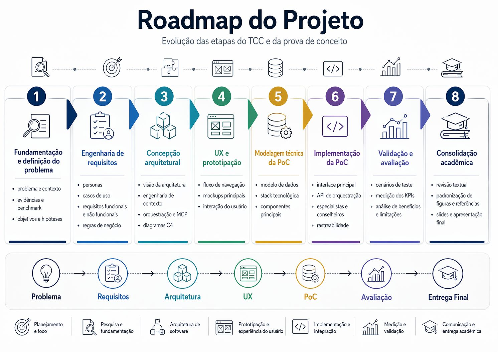

Fonte: Elaborado pela autora (2026).

A Tabela 11 detalha o planejamento executivo de cada marco,
especificando o esforço técnico exigido e o alinhamento com as entregas
formais do cronograma acadêmico:

Tabela 11: Roadmap do Projeto e Marcos de Entrega

|  |  |  |  |
|:--:|:--:|:--:|:--:|
| **Marco** | **Etapa do Projeto** | **Descrição Estratégica** | **Entregáveis Principais** |
| **M1** | Fundamentação e Visão do Produto | Consolidação do problema de pesquisa, com foco na fragmentação do conhecimento, na dependência de especialistas e na ausência de uma arquitetura para criação/importação de agentes especialistas. | Problema validado, benchmark, objetivos, hipóteses e KPIs revisados. |
| **M2** | Engenharia de Requisitos | Definição das personas, requisitos funcionais, requisitos não funcionais e regras de negócio, priorizando o fluxo de criação/importação de agentes e sua integração ao ecossistema. | Personas, casos de uso, RFs/RNFs, regras de negócio e fora de escopo. |
| **M3** | Concepção Arquitetural | Modelagem dos componentes centrais: Interface Técnica, Agent Builder, Importador de Agentes, Validador de modelo.md, Registro de Agent Skills, Orquestrador, Advisory Agent e camada de contratos. | Diagramas C4, matriz de responsabilidades, fluxo operacional e tratamento de exceções. |
| **M4** | UX e Prototipação | Desenho das telas principais da plataforma, com foco no fluxo de criação/importação de agentes, catálogo de Agent Skills, validação de contrato, teste de integração e acompanhamento da colaboração entre agentes. | Fluxo de navegação, wireframes, mapeamento de telas e feedback inicial. |
| **M5** | Modelagem Técnica da PoC | Definição do modelo de dados, stack tecnológica, contrato modelo.md, entidades de rastreabilidade e estratégia de implementação da PoC. | Stack definida, modelo conceitual, contrato do agente e estratégia de implementação. |
| **M6** | Implementação da PoC | Desenvolvimento dos componentes mínimos para validar a arquitetura: criação/importação de agente, validação do manifesto, registro da skill, orquestração com agentes existentes e logs do fluxo. | Protótipo funcional, APIs principais, banco de dados e fluxo plug-and-play executável. |
| **M7** | Validação e Avaliação | Execução dos cenários de teste, medição dos KPIs arquiteturais, validação da integração de um novo agente e análise de rastreabilidade. | Evidências de execução, logs, métricas, resultados da PoC e análise de viabilidade. |
| **M8** | Consolidação Acadêmica | Revisão textual, padronização dos artefatos, organização dos apêndices, ajustes finais e preparação da apresentação. | RFC final, apêndices, slides de defesa e repositório do projeto. |

## 

## 7.4 Épicos e Histórias de Usuário

Para organizar a implementação da PoC, o projeto será dividido em épicos
que representam as principais capacidades da arquitetura.

Tabela 12: Épicos e Histórias de Usuário

|  |  |  |
|:--:|:--:|:--:|
| **Épico** | **Objetivo** | **Exemplos de Histórias de Usuário** |
| **E1 — Gestão de Agentes** | Permitir criar, importar, validar, versionar e consultar agentes especialistas. | Como usuário técnico, quero importar um agente por meio de um arquivo modelo.md; como arquiteto, quero validar o contrato de entrada e saída de uma Agent Skill; como responsável técnico, quero habilitar ou desabilitar um agente. |
| **E2 — Catálogo de Agent Skills** | Manter o registro dos agentes disponíveis no ecossistema, incluindo domínio, versão, status, contratos e capacidades. | Como usuário técnico, quero visualizar quais agentes estão ativos; como arquiteto, quero consultar domínio, versão e contrato de uma skill; como gestor técnico, quero auditar quando uma skill foi criada ou alterada. |
| **E3 — Criação e Importação via modelo.md** | Permitir que novas Agent Skills sejam criadas ou importadas a partir de um manifesto técnico padronizado. | Como usuário técnico, quero criar um agente preenchendo um modelo orientado; como usuário técnico, quero importar um arquivo modelo.md; como sistema, preciso validar se o manifesto possui objetivo, domínio, capacidades, entradas, saídas e limites de atuação. |
| **E4 — Validação e Quality Gate** | Garantir que agentes e respostas respeitem contratos, regras de segurança, limites de atuação e critérios de qualidade. | Como Advisory Agent, preciso rejeitar respostas fora do contrato; como sistema, preciso sinalizar baixa confiança; como usuário, quero saber se o agente foi aprovado, rejeitado ou ficou pendente de ajuste. |
| **E5 — Orquestração Multiagente** | Permitir que o Orquestrador selecione agentes e coordene sua colaboração em fluxos técnicos. | Como usuário técnico, quero testar um agente recém-importado em conjunto com outros agentes; como Orquestrador, preciso selecionar skills compatíveis com a solicitação; como sistema, preciso registrar a participação de cada agente no fluxo. |
| **E6 — Observabilidade e Rastreabilidade** | Registrar todo o ciclo de vida do agente e das execuções realizadas no ecossistema. | Como usuário autorizado, quero consultar logs de execução; como responsável técnico, quero auditar qual agente participou de uma resposta; como arquiteto, quero verificar se uma skill causou erro de contrato. |
| **E7 — UX da Plataforma** | Tornar visível o processo de criação, importação, validação, teste e colaboração entre agentes. | Como usuário, quero acompanhar o status da importação; como usuário, quero visualizar a integração do agente ao ecossistema; como usuário, quero entender por que uma skill foi rejeitada. |
| **E8 — Histórico e Governança do Ecossistema** | Permitir consulta posterior sobre agentes, versões, validações, execuções e decisões registradas. | Como responsável técnico, quero consultar o histórico de versões de um agente; como arquiteto, quero revisar decisões tomadas pelo ecossistema; como usuário autorizado, quero recuperar execuções anteriores para reaproveitamento técnico. |

# 

# 8. Referências

**9. Apêndices e Materiais Complementares**

Os apêndices a seguir reúnem os artefatos visuais, os detalhamentos
teóricos e as evidências práticas que fundamentam as decisões
arquiteturais apresentadas no corpo deste RFC. Esta seção garante a
rastreabilidade metodológica e o rigor científico do projeto, sem
comprometer a fluidez da leitura técnica e executiva principal.

### Apêndice A — Evidências do Problema: Detalhamento da Matriz de Competências e Riscos Operacionais

A evidência empírica que originou este projeto foi obtida por meio da
análise documental qualitativa de uma matriz de competências de um time
de produto atuante no desenvolvimento de um sistema ERP corporativo. A
análise permitiu identificar a severidade da fragmentação do
conhecimento por meio dos seguintes indicadores de lacuna (GAPs):

- **GAPs nos *Experts* (Especialistas):** Observou-se a concentração de
  conhecimento crítico e de negócio legado em poucos indivíduos, gerando
  "pontos únicos de falha". O impacto operacional é a interrupção de
  fluxos e o aumento do *lead time* devido à indisponibilidade
  estrutural desses colaboradores.

- **GAPs nos Praticantes:** Identificou-se a ausência de profissionais
  com nível inicial e intermediário em tecnologias legadas específicas.
  Isso gera uma barreira de entrada intransponível e sobrecarrega os
  seniores com tarefas de baixo valor cognitivo.

- **Isolamento de Domínio:** Constatou-se uma baixa sobreposição entre
  os domínios de negócio e tecnologias. O risco de regressões e erros
  sistêmicos por falta de contexto funcional cruzado mostrou-se elevado.

Este cenário evidenciou qualitativamente que a integração humana baseada
apenas em reuniões e consultas diretas apresenta limitações importantes
de escala, justificando a necessidade relevante de uma arquitetura de
orquestração de Agent Skills como camada de resiliência cognitiva.

Figura A.1 - Matriz de competência anonimizada

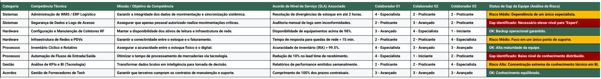

Fonte: Elaborado pela autora (2026).

### 

### Apêndice B — Estudo Aprofundado de Ferramentas Multiagentes (Benchmark)

A concepção da arquitetura exigiu a avaliação crítica das soluções de
inteligência generativa disponíveis no mercado, especialmente aquelas
voltadas à construção de agentes, automação de tarefas, colaboração
multiagente e assistência ao desenvolvimento de software. A análise
permitiu identificar que, embora existam ferramentas robustas para
criação e coordenação de agentes artificiais, ainda há lacunas
relacionadas à governança corporativa, contratos formais,
rastreabilidade integral, validação de saídas e controle do ciclo de
vida dos agentes.

A seguir, apresenta-se o referencial técnico que embasou o desenho da
arquitetura proposta.

● LangChain / LangGraph: Plataforma voltada à construção de aplicações
baseadas em modelos de linguagem, integração com ferramentas,
Retrieval-Augmented Generation (RAG) e fluxos multiagentes. O LangGraph
amplia esse ecossistema ao permitir a modelagem de fluxos mais
estruturados, com estados, etapas e coordenação entre componentes. Seu
ponto forte está na flexibilidade de composição e na integração com
diferentes fontes, ferramentas e modelos. Entretanto, sua adoção em
ambientes corporativos críticos ainda exige decisões arquiteturais
adicionais relacionadas à governança, contratos formais,
rastreabilidade, validação de saídas, controle de permissões e ciclo de
vida dos agentes. Assim, embora seja uma base tecnológica relevante, não
elimina a necessidade de uma arquitetura própria de integração, controle
e auditoria.

● AutoGPT: Ferramenta voltada à execução autônoma de tarefas a partir de
objetivos amplos definidos pelo usuário. Seu principal diferencial está
na tentativa de planejar e executar ações de maneira autônoma, reduzindo
a necessidade de intervenção humana constante. Contudo, essa autonomia
também representa uma limitação em cenários corporativos críticos, pois
pode gerar baixa previsibilidade, dificuldade de controle fino do fluxo,
dependência de decisões inferenciais e riscos de execução fora do escopo
esperado. Dessa forma, o AutoGPT não atende integralmente aos requisitos
de governança, rastreabilidade, validação cruzada e controle rigoroso
necessários em ambientes organizacionais seguros.

● CrewAI: Framework que permite simular equipes de agentes com papéis
definidos, favorecendo a divisão de responsabilidades e a colaboração
entre especialistas artificiais. Sua estrutura baseada em agentes,
tarefas e equipes aproxima-se da lógica de decomposição de problemas
complexos em subtarefas. No entanto, a comunicação entre os agentes
tende a se apoiar predominantemente em mensagens textuais e na
coordenação de papéis, exigindo complementações para cenários que
demandam contratos técnicos formais, validação rígida por schemas,
rastreabilidade completa e mecanismos explícitos de governança. Assim,
embora contribua para a organização colaborativa de agentes, não
substitui uma arquitetura corporativa orientada a contratos e auditoria.

● Microsoft AutoGen: Framework voltado à construção de conversações e
fluxos colaborativos entre agentes, incluindo coordenação de tarefas,
interação entre múltiplos agentes e execução de código. A ferramenta
demonstra potencial para prototipação e experimentação de sistemas
multiagentes, especialmente em cenários nos quais diferentes agentes
precisam interagir para resolver uma demanda. Entretanto, sua aplicação
em ambientes corporativos críticos ainda demanda complementação
arquitetural para garantir contratos formais, rastreabilidade integral,
governança, controle do ciclo de vida dos agentes, validação de
respostas e integração padronizada com sistemas internos. Portanto, o
AutoGen contribui para a coordenação multiagente, mas não resolve
sozinho os requisitos de controle, auditabilidade e governança propostos
neste trabalho.

● Gemini Code Assist / Google Antigravity: Ecossistema do Google voltado
à assistência ao desenvolvimento de software, integração com IDEs, apoio
à produtividade técnica e execução de fluxos agênticos de codificação.
Essas ferramentas representam uma evolução em relação aos copilots
tradicionais, pois ampliam o suporte ao ciclo de vida de desenvolvimento
e à automação de tarefas técnicas. Entretanto, seu foco principal
permanece associado à produtividade do desenvolvedor, à assistência de
codificação e à automação de atividades de software. A proposta deste
trabalho diferencia-se por tratar a orquestração de agentes como uma
arquitetura corporativa independente, baseada em manifestos, contratos
formais, quality gate, rastreabilidade, governança transversal e
integração plug-and-play de Agent Skills.

Conclusão do Estudo: A análise das ferramentas evidencia que a lacuna
metodológica não está na ausência de modelos de linguagem inteligentes
ou de frameworks para criação de agentes, mas na ausência de um padrão
arquitetural voltado à integração corporativa, governança e
rastreabilidade de agentes especialistas. As soluções existentes
oferecem recursos relevantes para automação, colaboração e assistência
técnica, mas ainda exigem complementações quando aplicadas a ambientes
organizacionais críticos. Nesse sentido, a arquitetura proposta neste
RFC diferencia-se por estruturar os agentes como componentes
interoperáveis, orientados por contratos formais, governados por
mecanismos de validação e integrados a uma linha de trabalho auditável,
extensível e agnóstica a fornecedores.

### 

### Apêndice C — Contratos de Comunicação e Especificações Técnicas (MCP)

Este apêndice documenta os *schemas* JSON e as especificações dos
contratos baseados no paradigma do *Model Context Protocol (MCP)*. Os
artefatos abaixo evidenciam como o Orquestrador (*Project Manager*) e os
Especialistas Artificiais trocam mensagens de forma rigidamente tipada,
garantindo o isolamento estrutural e o tratamento de exceções
(*fallback*).

Figura C.1 – Diagrama de comunicação via MCP e contratos técnicos

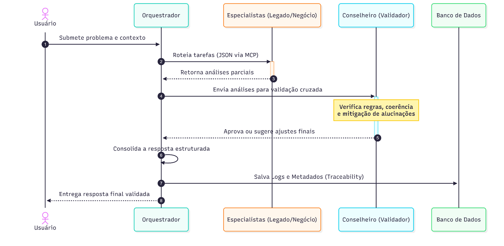

Fonte: Elaborado pela autora (2026).

### 

### 1. Schema de Entrada: solicitacao_analise_schema.json

Este contrato valida o *payload* enviado pela interface web para a API
de Orquestração (cumprindo o **RF01** e gerando a estrutura para o
**RF02**).

JSON

{

"\$schema": "http://json-schema.org/draft-07/schema#",

"title": "SolicitacaoAnaliseTecnica",

"description": "Contrato rígido para submissão de demandas de análise
técnica no ecossistema.",

"type": "object",

"properties": {

"trace_id": {

"description": "Identificador único global da sessão para fins de
rastreabilidade (UUID v4).",

"type": "string",

"pattern":
"^\[0-9a-fA-F\]{8}-\[0-9a-fA-F\]{4}-\[0-9a-fA-F\]{4}-\[0-9a-fA-F\]{4}-\[0-9a-fA-F\]{12}\$"

},

"metadata": {

"type": "object",

"properties": {

"usuario_id": { "type": "string" },

"timestamp_criacao": { "type": "string", "format": "date-time" },

"sistema_origem": { "type": "string", "example": "ERP-Financeiro" }

},

"required": \["usuario_id", "timestamp_criacao"\]

},

"contexto_negocio": {

"description": "Detalhamento funcional da regra de negócio ou processo
técnico associado.",

"type": "string",

"minLength": 10

},

"artefatos": {

"description": "Lista de componentes técnicos, códigos ou documentações
submetidos para varredura.",

"type": "array",

"minItems": 1,

"items": {

"type": "object",

"properties": {

"nome_arquivo": { "type": "string", "example": "stateSon.js" },

"tipo_artefato": { "type": "string", "enum": \["codigo_fonte",
"documentacao_api", "requisito_funcional"\] },

"conteudo": { "type": "string", "description": "Conteúdo bruto ou trecho
de código isolado." },

"linguagem": { "type": "string", "example": "javascript" }

},

"required": \["nome_arquivo", "tipo_artefato", "conteudo"\]

}

},

"escopo_analise": {

"type": "object",

"properties": {

"analises_requeridas": {

"type": "array",

"items": { "type": "string", "enum": \["legado", "negocio",
"arquitetura", "impacto"\] }

},

"profundidade": { "type": "string", "enum": \["superficial",
"detalhada"\], "default": "detalhada" }

},

"required": \["analises_requeridas"\]

}

},

"required": \["trace_id", "metadata", "contexto_negocio", "artefatos",
"escopo_analise"\],

"additionalProperties": false

}

### 

### 2. Schema de Saída Intermediária/Final: resposta_especialista_schema.json

Este contrato dita o formato obrigatório de resposta de qualquer *Agent
Skill* (especialistas) antes e depois da validação cruzada pelo *Quality
Gate* (cumprindo o **RF03**, **RF06** e **RN04**).

JSON

{

"\$schema": "http://json-schema.org/draft-07/schema#",

"title": "RespostaEspecialistaArtificil",

"description": "Contrato de saída estruturada para tráfego via MCP entre
especialistas e orquestradores.",

"type": "object",

"properties": {

"trace_id": { "type": "string" },

"agente_emissor": {

"type": "object",

"properties": {

"nome": { "type": "string", "example": "Agent-Skill-Codigo-Legado" },

"versao_prompt": { "type": "string", "example": "v1.4.2" },

"dominio": { "type": "string", "enum": \["codigo_legado",
"regras_negocio", "arquitetura_software"\] }

},

"required": \["nome", "dominio"\]

},

"analise_estruturada": {

"type": "object",

"properties": {

"resumo_executivo": { "type": "string" },

"descobertas_tecnicas": {

"type": "array",

"items": {

"type": "object",

"properties": {

"item_identificado": { "type": "string" },

"descricao_detalhada": { "type": "string" },

"trecho_referenciado": { "type": "string", "description": "Snippet de
código ou texto associado à descoberta." }

},

"required": \["item_identificado", "descricao_detalhada"\]

}

},

"impactos_mapeados": {

"type": "array",

"items": { "type": "string", "description": "Riscos de regressão ou
acoplamentos identificados." }

}

},

"required": \["resumo_executivo", "descobertas_tecnicas",
"impactos_mapeados"\]

},

"governanca": {

"type": "object",

"properties": {

"nivel_confianca": { "type": "string", "enum": \["ALTO", "MEDIO",
"BAIXO"\] },

"justificativa_confianca": { "type": "string" },

"referencias_catalogo": {

"type": "array",

"items": { "type": "string", "description": "Padrões arquiteturais
oficiais referenciados." }

}

},

"required": \["nivel_confianca", "justificativa_confianca"\]

}

},

"required": \["trace_id", "agente_emissor", "analise_estruturada",
"governanca"\],

"additionalProperties": false

}

### 

### Apêndice D — Modelagem de Dados e Arquitetura de Componentes

Apresenta-se a visão de persistência relacional e a topologia de
classes/componentes da solução. Os artefatos visam comprovar a
integridade transacional exigida na Engenharia de Requisitos,
demonstrando o funcionamento do *Trace ID* na vinculação das
requisições, interações (*logs*) e respostas consolidadas.

Figura D.1 – Modelo conceitual de dados da prova de conceito (MER/DER)

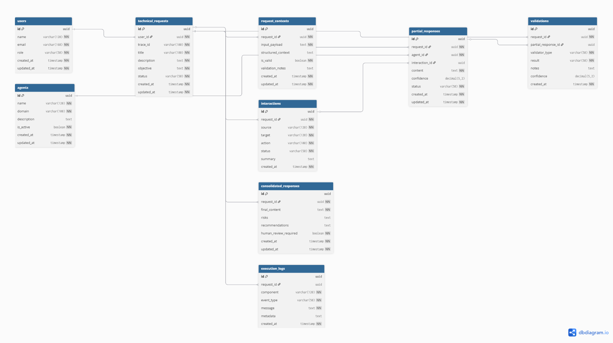

Fonte: Elaborado pela autora (2026).

## Apêndice E — Mockups e Wireframes

Este apêndice reúne os mockups e wireframes desenvolvidos para
representar a experiência do usuário na plataforma. Para manter a
navegação objetiva e evitar excesso de telas, os protótipos foram
organizados em uma sequência simplificada, agrupando funcionalidades
relacionadas dentro da mesma interface.

O objetivo não é representar cada ação do sistema como uma tela
independente, mas demonstrar o fluxo principal da arquitetura:
autenticação, visão geral do ecossistema, gestão de Agent Skills,
criação ou importação de agentes, validação, teste, orquestração,
resposta consolidada e rastreabilidade.

As telas previstas são:

> Figura E.1 — Login

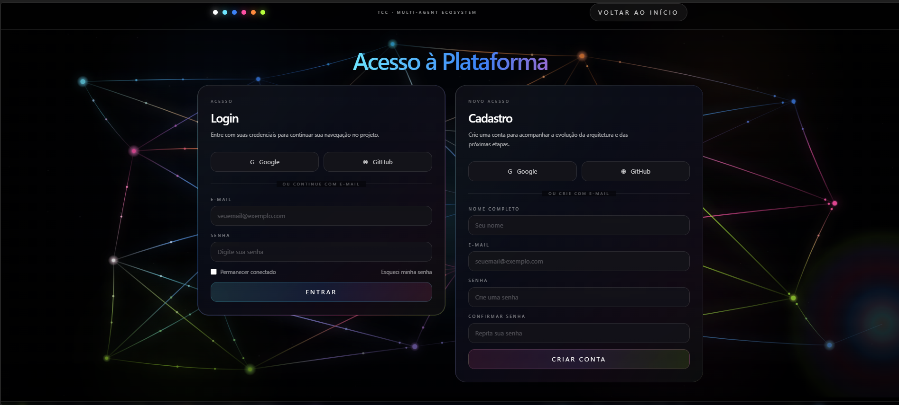

Fonte: Elaborado pela autora (2026).

> Figura E.2 — Dashboard do Ecossistema

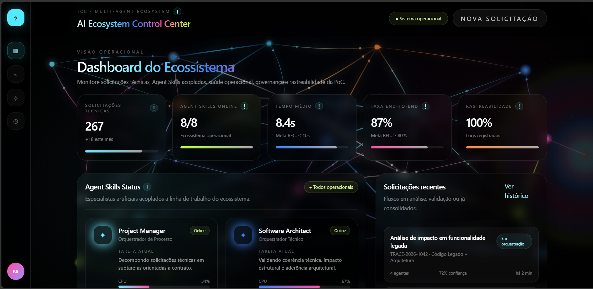

Fonte: Elaborado pela autora (2026).

> Figura E.3 — Catálogo de Agent Skills

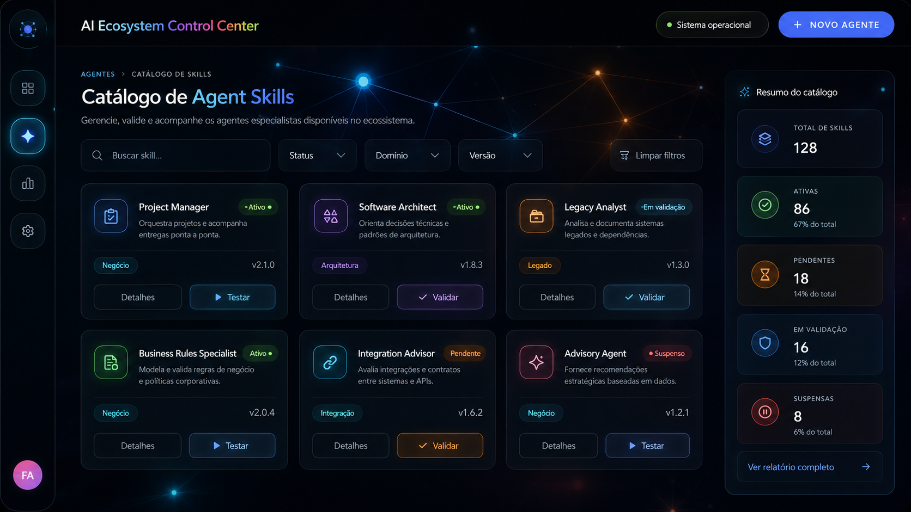

Fonte: Elaborado pela autora (2026).

> Figura E.4 — Criar ou Importar Agente

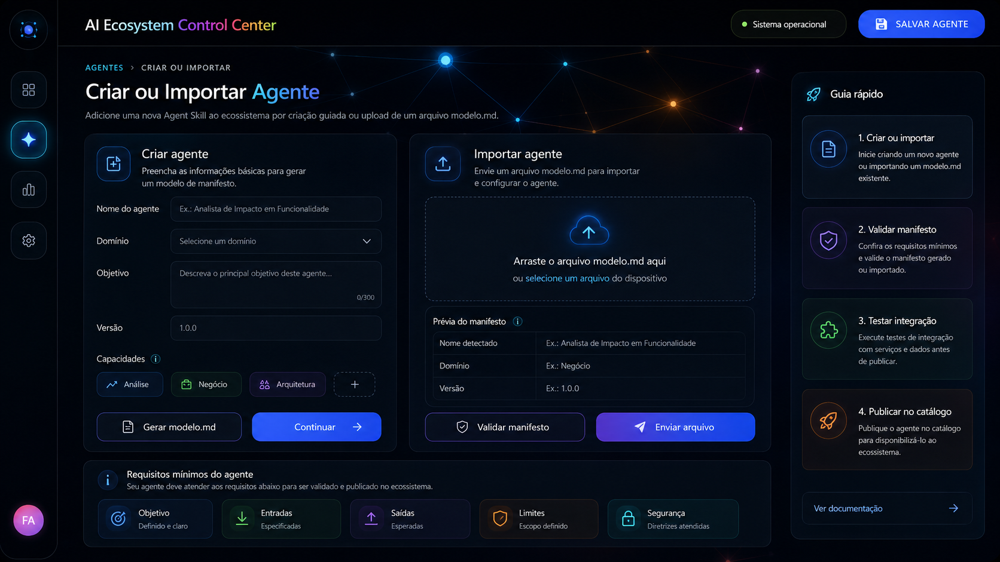

Fonte: Elaborado pela autora (2026).

> Figura E.5 — Validação e Teste do Agente

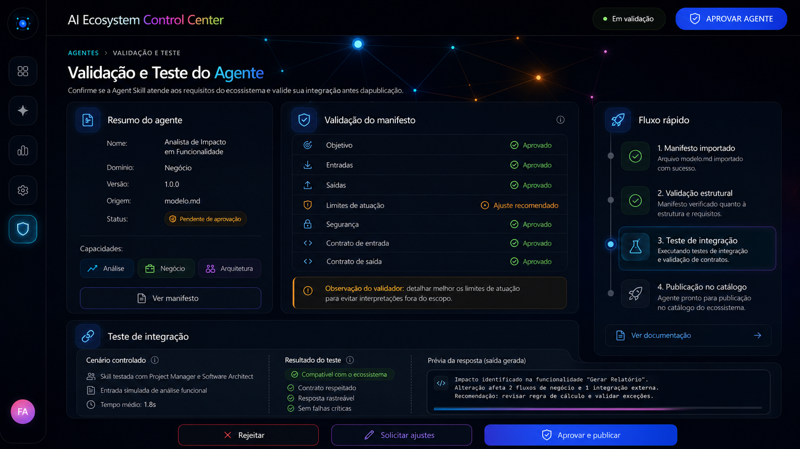

Fonte: Elaborado pela autora (2026).

> Figura E.6 — Solicitação Técnica e Orquestração

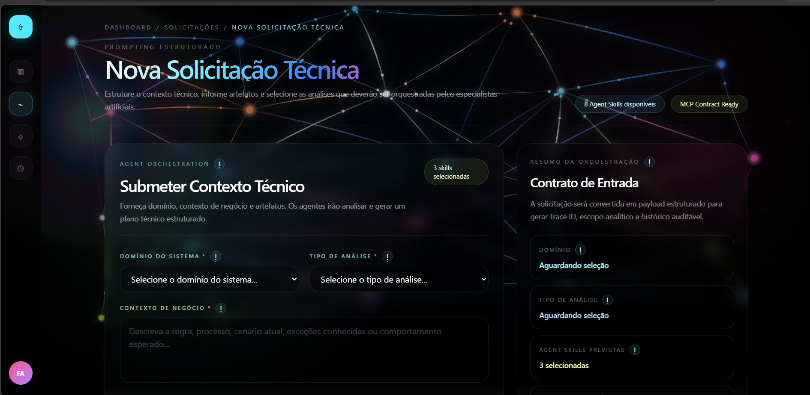

Fonte: Elaborado pela autora (2026).

> Figura E.7 — Resposta Consolidada e Histórico

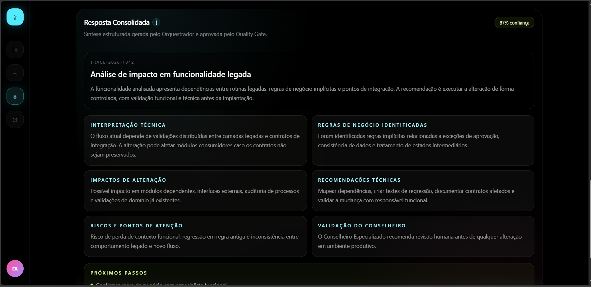

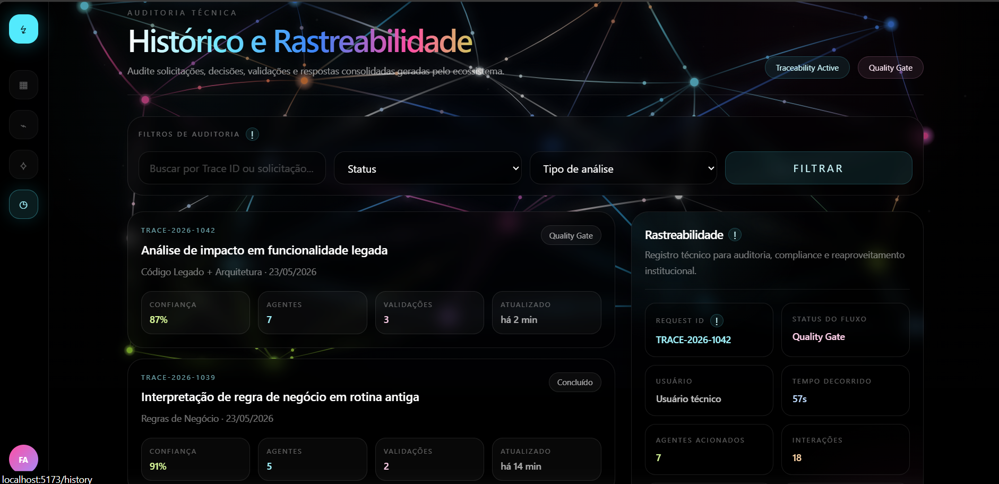

> Figura E.7 — Resposta Consolidada e Histórico

Essa organização reduz a quantidade de interfaces apresentadas no
documento e torna a experiência mais coerente com uma Prova de Conceito.
As funcionalidades de upload, validação de manifesto e teste de
integração continuam contempladas, mas agrupadas em telas mais completas
e menos fragmentadas.

### Apêndice F — Gestão Ágil e Rastreabilidade do Projeto

Em conformidade com a Seção 7 (Planejamento do Projeto), constam abaixo
as evidências extraídas da ferramenta de gestão Jira. As capturas de
tela comprovam a governança metodológica e a decomposição técnica dos
requisitos em Épicos e Histórias de Usuário, validando os marcos
temporais estabelecidos.

Figura F.1 – Quadro Kanban utilizado para gestão ágil do projeto

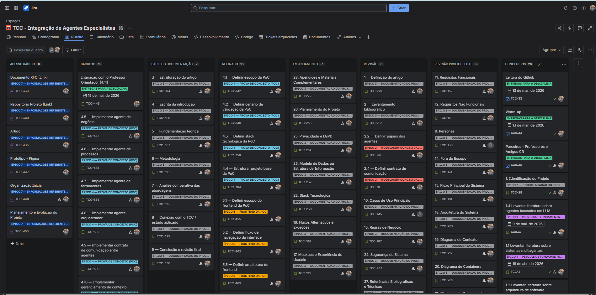

Fonte: Elaborado pela autora (2026).

**Apêndice G — Modelo de Agente (modelo.md) e Contrato de Importação**

Este apêndice apresenta a estrutura conceitual do arquivo modelo.md,
utilizado para criar ou importar uma nova Agent Skill no ecossistema.

O modelo.md funciona como um manifesto técnico do agente. Ele descreve
sua identidade, domínio de atuação, capacidades, entradas esperadas,
saídas produzidas, limites, regras de segurança, dependências, exemplos
de uso e critérios mínimos de validação.

### Estrutura mínima do modelo.md

\# Nome do Agente

\## Identificação

\- Nome:

\- Versão:

\- Autor/Origem:

\- Domínio de atuação:

\- Status inicial: pendente de validação

\## Objetivo

Descrever de forma clara qual problema este agente resolve dentro do
ecossistema.

\## Capacidades

\- Capacidade 1

\- Capacidade 2

\- Capacidade 3

\## Entradas Esperadas

Descrever quais informações o agente precisa receber para executar
corretamente sua função.

Exemplo:

\- contexto técnico

\- artefato de código

\- documentação funcional

\- restrições arquiteturais

\## Saídas Produzidas

Descrever o formato esperado da resposta do agente.

Exemplo:

\- resumo técnico

\- descobertas

\- riscos

\- recomendações

\- nível de confiança

\- limitações

\## Limites de Atuação

Descrever o que o agente não pode fazer.

Exemplo:

\- não aprovar decisões arquiteturais finais

\- não executar alterações em código

\- não realizar deploy

\- não acessar dados fora do contexto recebido

\## Contrato de Entrada

Descrever ou referenciar o schema de entrada esperado.

\## Contrato de Saída

Descrever ou referenciar o schema de saída obrigatório.

\## Regras de Segurança

\- não processar credenciais

\- sinalizar dados sensíveis

\- respeitar escopo read-only

\- indicar baixa confiança quando necessário

\## Exemplos de Uso

Apresentar um ou mais exemplos de solicitação em que o agente pode ser
acionado.

\## Critérios de Validação

\- contrato válido

\- domínio definido

\- saída estruturada

\- limites explícitos

\- teste controlado aprovado

A partir desse arquivo, o sistema deverá executar uma validação
estrutural antes de registrar o agente no catálogo. Caso o manifesto
esteja incompleto, ambíguo ou viole regras de governança, o agente deve
permanecer com status pendente ou rejeitado.

## 

## Apêndice H — Cenários de Teste da PoC

Este apêndice apresenta os cenários utilizados para validar a Prova de
Conceito.

Os cenários mínimos são:

- **Cenário 1 — Importação de agente válido:** o usuário importa um
  arquivo modelo.md completo, o sistema valida a estrutura, registra a
  Agent Skill no catálogo e habilita o agente para teste.

- **Cenário 2 — Importação de agente inválido:** o usuário importa um
  modelo.md incompleto ou sem limites de atuação, o sistema rejeita o
  cadastro e apresenta os motivos da falha.

- **Cenário 3 — Criação de agente assistida:** o usuário preenche um
  formulário ou editor orientado, o sistema gera a estrutura do
  modelo.md e submete o agente para validação.

- **Cenário 4 — Colaboração com agentes existentes:** o novo agente é
  acionado em conjunto com outras Agent Skills já registradas,
  demonstrando que consegue trabalhar dentro do fluxo orquestrado.

- **Cenário 5 — Falha de contrato:** o agente retorna uma saída fora do
  schema esperado, a camada de contratos rejeita a resposta e registra a
  falha.

- **Cenário 6 — Validação pelo quality gate:** o Advisory Agent avalia a
  resposta consolidada e aprova, rejeita ou sinaliza necessidade de
  revisão humana.

- **Cenário 7 — Auditoria do fluxo:** o usuário consulta o histórico e
  visualiza qual agente foi importado, quando foi validado, em quais
  fluxos participou e quais decisões foram registradas.

## 

## Apêndice I — Critérios de Avaliação da PoC

Este apêndice detalha os critérios utilizados para avaliar a Prova de
Conceito.

A PoC será considerada bem-sucedida se demonstrar:

- criação ou importação de pelo menos uma Agent Skill via modelo.md;

- validação estrutural do manifesto;

- registro da skill no catálogo;

- associação da skill a um contrato de entrada e saída;

- execução de um teste controlado;

- acionamento do novo agente em conjunto com agentes já existentes;

- validação da resposta pelo quality gate;

- registro de 100% das etapas por Trace ID;

- consulta posterior ao histórico do agente e do fluxo;

- demonstração de que o agente pode ser integrado sem alteração do
  núcleo do Orquestrador.

Esses critérios reforçam o foco central do projeto: validar uma
arquitetura extensível, governada e rastreável para integração de
agentes especialistas, e não apenas demonstrar respostas geradas por IA.

# 

# 10. Parecer do Comitê de Avaliação

Avaliador 1:
\_\_\_\_\_\_\_\_\_\_\_\_\_\_\_\_\_\_\_\_\_\_\_\_\_\_\_\_\_\_\_\_\_\_\_\_\_\_\_\_\_\_\_\_\_\_\_\_\_\_\_\_\_\_\_\_\_\_\_\_\_\_\_\_\_

Status: \[ \] Aprovado \[ \] Ajustar

Observações:

\_\_\_\_\_\_\_\_\_\_\_\_\_\_\_\_\_\_\_\_\_\_\_\_\_\_\_\_\_\_\_\_\_\_\_\_\_\_\_\_\_\_\_\_\_\_\_\_\_\_\_\_\_\_\_\_\_\_\_\_\_\_\_\_\_\_\_\_\_\_\_\_\_\_\_\_\_\_\_\_\_\_\_\_\_\_\_\_\_\_\_\_\_\_\_\_\_\_\_\_\_\_\_\_\_\_\_\_\_\_\_\_\_\_\_\_\_\_\_\_\_\_\_\_\_\_\_\_\_\_\_\_\_\_\_\_\_\_\_\_\_\_\_\_\_\_\_\_\_\_\_\_\_\_\_\_\_\_\_\_\_\_\_\_\_\_\_\_\_\_\_\_\_\_\_\_\_\_\_\_\_\_\_\_\_\_\_\_\_\_\_\_\_\_\_\_\_\_\_\_\_\_\_\_\_\_\_\_\_\_\_\_\_\_\_\_\_\_\_\_\_\_\_\_\_\_\_\_\_\_\_\_\_\_\_\_\_\_\_\_\_\_\_\_\_\_\_\_\_\_\_\_\_\_\_\_\_\_\_\_\_\_\_\_\_\_\_\_\_\_\_\_\_\_\_\_

Avaliador 2:
\_\_\_\_\_\_\_\_\_\_\_\_\_\_\_\_\_\_\_\_\_\_\_\_\_\_\_\_\_\_\_\_\_\_\_\_\_\_\_\_\_\_\_\_\_\_\_\_\_\_\_\_\_\_\_\_\_\_\_\_\_\_\_\_\_

Status: \[ \] Aprovado \[ \] Ajustar

Observações:

\_\_\_\_\_\_\_\_\_\_\_\_\_\_\_\_\_\_\_\_\_\_\_\_\_\_\_\_\_\_\_\_\_\_\_\_\_\_\_\_\_\_\_\_\_\_\_\_\_\_\_\_\_\_\_\_\_\_\_\_\_\_\_\_\_\_\_\_\_\_\_\_\_\_\_\_\_\_\_\_\_\_\_\_\_\_\_\_\_\_\_\_\_\_\_\_\_\_\_\_\_\_\_\_\_\_\_\_\_\_\_\_\_\_\_\_\_\_\_\_\_\_\_\_\_\_\_\_\_\_\_\_\_\_\_\_\_\_\_\_\_\_\_\_\_\_\_\_\_\_\_\_\_\_\_\_\_\_\_\_\_\_\_\_\_\_\_\_\_\_\_\_\_\_\_\_\_\_\_\_\_\_\_\_\_\_\_\_\_\_\_\_\_\_\_\_\_\_\_\_\_\_\_\_\_\_\_\_\_\_\_\_\_\_\_\_\_\_\_\_\_\_\_\_\_\_\_\_\_\_\_\_\_\_\_\_\_\_\_\_\_\_\_\_\_\_\_\_\_\_\_\_\_\_\_\_\_\_\_\_\_\_\_\_\_\_\_\_\_\_\_\_\_\_\_\_
