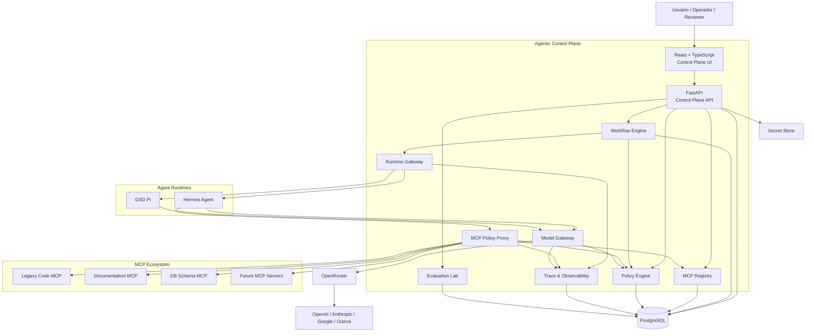
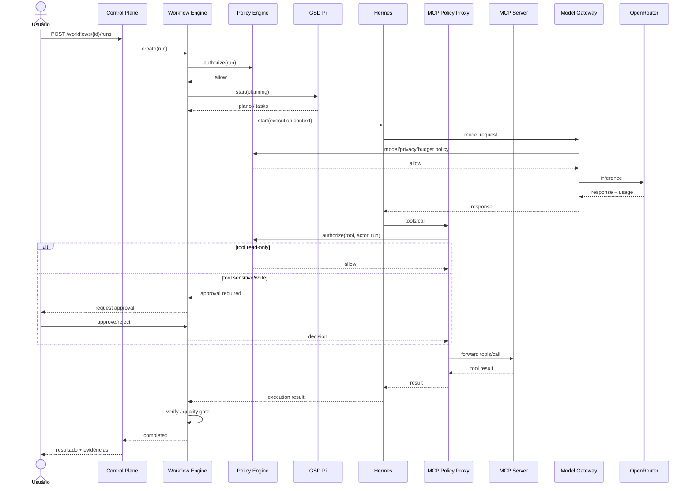
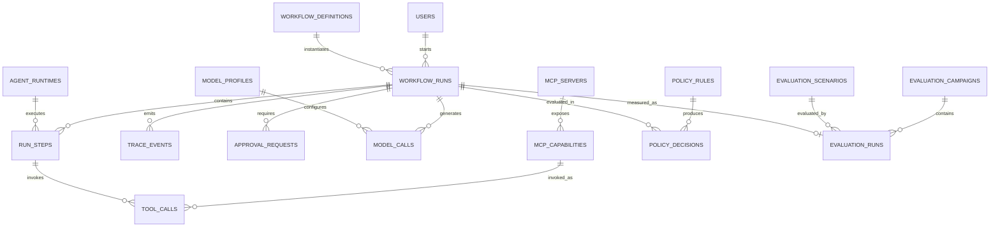
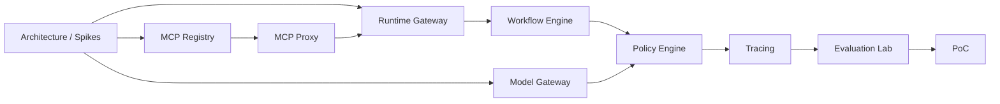

# Documento de referência — Ecossistema Agentic Control Plane com MCP, Hermes, GSD Pi e OpenRouter

## Resumo executivo

A recomendação é evoluir a base já codada para um **Agentic Control Plane**: uma camada central de governança que registra capacidades MCP, inicia e acompanha runtimes agênticos, aplica políticas antes de ações sensíveis, controla modelos e custos, correlaciona toda execução por `Trace ID` e oferece um laboratório de avaliação comparável.

O ponto arquitetural mais importante é **não reconstruir Hermes, GSD Pi ou um roteador de LLMs dentro do projeto**. Hermes já oferece runtime agêntico, ferramentas, subagentes, memória, skills e integração com servidores MCP; GSD Pi já oferece planejamento estruturado em milestones/slices/tasks, execução com verificação, isolamento por Git worktrees e persistência local de estado; OpenRouter fornece uma API unificada para um catálogo atualmente anunciado como superior a 400 modelos e 70 providers. O projeto deve agregar valor exatamente onde esses componentes não formam, por si só, uma camada central de governança. citeturn18view1turn19view2turn18view0turn22view3

A versão atual publicada da especificação MCP, **2026-07-28**, mudou a base para requisições stateless e negociação de capabilities por request, mantendo `Tools`, `Resources` e `Prompts` como primitivas centrais; a especificação também lista extensões como Tasks e Skills over MCP. citeturn18view3 Para o projeto, isso torna MCP muito mais do que um “adaptador de ferramentas”: ele passa a ser o **contrato de interoperabilidade** entre o Control Plane e o ecossistema de capacidades.

Há, porém, um risco de versão que precisa entrar explicitamente no desenho. O repositório do Hermes possui um issue aberto rastreando a migração para MCP 2026-07-28 e `mcp>=2.0`, indicando que o runtime ainda precisa concluir essa transição. citeturn18view2 Além disso, releases recentes do GSD Pi registram problemas de interoperabilidade entre `open-gsd-hermes` e `gsd-mcp-server`, inclusive divergência de framing/transporte e timeout. citeturn21search0 Portanto, **Hermes e GSD não devem ser acoplados diretamente como fundação da arquitetura**; ambos devem ficar atrás do `Runtime Gateway`.

A decisão de usar **OpenRouter como Model Gateway primário da PoC é tecnicamente coerente** com o objetivo de experimentação. O plano pay-as-you-go atual anuncia 400+ modelos, 70+ providers, sem gasto mínimo e com taxa de plataforma de 5,5%; seu roteamento permite preferências por provider, preço, throughput, latência e ZDR. citeturn22view3turn16search6 Isso permite comparar modelos sem trocar a arquitetura e preservar o adaptador OpenAI existente apenas como integração direta opcional.

O estado final recomendado é:

```text
Usuário
  │
  ▼
Agentic Control Plane
  │
  ├── MCP Registry + MCP Policy Proxy
  ├── Workflow Engine
  ├── Runtime Gateway
  │      ├── Hermes Adapter
  │      └── GSD Pi Adapter
  ├── Model Gateway
  │      └── OpenRouter
  ├── Policy Engine
  ├── Trace & Observability
  └── Evaluation Lab
```

A base informada já cobre uma parcela relevante da infraestrutura: **FastAPI, React + TypeScript, PostgreSQL, Docker, autenticação, Trace ID, orquestração básica, mock provider e adaptador OpenAI**. Não é necessário recomeçar. A principal transformação será converter a orquestração existente em um Workflow Engine persistente, a abstração de provider em Model Gateway, o Trace ID em tracing distribuído e adicionar Registry/Proxy MCP, Runtime Gateway, Policy Engine e Evaluation Lab.

**Objetivo técnico da PoC recomendado:**

> Demonstrar que uma nova capacidade pode ser incorporada ao ecossistema por meio de um MCP Server, descoberta, governada, utilizada por um runtime agêntico e observada ponta a ponta **sem alteração do núcleo do Control Plane**.

**Objetivo experimental recomendado:**

> Demonstrar que o mesmo cenário pode ser executado com diferentes runtimes e modelos, mantendo constantes workflow, políticas e capabilities, permitindo comparar qualidade, custo, latência, número de tool calls, falhas e intervenção humana.

**Premissa de planejamento:** como não foi informado tamanho da equipe nem prazo obrigatório, o cronograma abaixo assume **um desenvolvedor principal**, apoio eventual do orientador e sprints de duas semanas. A estimativa-base é de **oito sprints, ou dezesseis semanas**. Com duas pessoas trabalhando em paralelo, alguns itens podem sobrepor-se, mas os spikes de compatibilidade e a PoC continuam no caminho crítico.

## Arquitetura alvo e responsabilidades

O sistema deve separar claramente **Control Plane** e **Data Plane**.

O Control Plane determina *o que pode acontecer*: workflow, policies, runtimes permitidos, modelos, orçamento, approvals, credenciais e rastreabilidade. O Data Plane é onde *a execução acontece*: Hermes, GSD Pi, chamadas de modelo e servidores MCP.

Essa separação é particularmente importante porque o Hermes consegue descobrir automaticamente tools de servidores MCP locais via `stdio` ou remotos via HTTP e também registrar wrappers para Resources e Prompts. citeturn19view2 Se Hermes for configurado diretamente com todos os servidores, o Control Plane deixa de ter um ponto confiável de enforcement. Portanto, a recomendação é que os runtimes enxerguem **um MCP Proxy controlado pelo projeto**, e não credenciais/endpoints arbitrários de servidores upstream.

**C4 simplificado — contexto e containers**



Essa arquitetura segue a separação MCP entre host/client/server: aplicações host conectam-se a servers que fornecem contexto e capabilities; o protocolo atual usa JSON-RPC 2.0, requisições autocontidas/stateless e capabilities negociadas por request. citeturn18view3

**Responsabilidade dos componentes**

| Componente | Responsabilidade | Não deve fazer |
|---|---|---|
| **Control Plane** | API/UI central, identidade, configuração, governança, operações | Implementar raciocínio de agente |
| **MCP Registry** | Cadastrar servers, descobrir e versionar Tools/Resources/Prompts | Executar tools sem policy |
| **MCP Policy Proxy** | Ser o ponto de passagem MCP dos runtimes, aplicar policy, tracing e approvals | Tomar decisão de negócio sozinho |
| **Runtime Gateway** | Normalizar Hermes, GSD e futuros runtimes através de `AgentRuntime` | Conhecer detalhes de negócio do workflow |
| **Workflow Engine** | Estado persistente, steps, retry, timeout, pause/resume, checkpoints | Confiar no estado interno do runtime como fonte oficial |
| **Model Gateway** | Interface única de inferência, roteamento, custo, ZDR e fallback | Decidir autorização de ferramentas |
| **Policy Engine** | RBAC, tool risk, allow/deny, budget, privacy, approval | Executar agentes |
| **Trace & Observability** | Correlacionar runs, models, tools, errors, custos e duração | Armazenar conteúdo sensível desnecessariamente |
| **Evaluation Lab** | Executar campanhas comparáveis e calcular KPIs | Alterar comportamento produtivo para “melhorar” teste |

O **MCP Registry** deve modelar as três primitivas principais separadamente. Tools são funções executáveis pelo modelo; Resources representam dados/contexto identificados por URI; Prompts representam templates/workflows oferecidos pelo server. citeturn14view0turn15search29turn14view2

Uma consequência importante é que o antigo conceito de `modelo.md` deixa de ser o único contrato de plug-in. O núcleo deve funcionar apenas com MCP core. A iniciativa oficial **Skills over MCP** está ativa, mas sua direção atual ainda passa por um SEP/extension em revisão; portanto, ela deve ser acompanhada como evolução futura, não usada como dependência P0 da PoC. citeturn19view0

O mesmo vale para **MCP Tasks**. Tasks oferecem handles duráveis, polling, estados como `working`, `input_required`, `completed`, `failed` e `cancelled`, sendo úteis para operações longas e human-in-the-loop, mas são uma extensão opt-in cujo suporte varia por cliente. citeturn19view1 O Workflow Engine próprio deve continuar sendo a fonte oficial de estado; posteriormente ele poderá mapear um step para um MCP Task quando client e server suportarem a extensão.

**Posicionamento do Hermes**

Hermes deve ser tratado como um **runtime de execução agêntica**, não como núcleo do projeto. Ele já suporta múltiplos providers, subagentes, execução em diferentes terminal backends, skills e MCP. citeturn18view1 No MCP, atualmente suporta servidores `stdio` e HTTP, discovery automático, filtragem de tools e Resources/Prompts. citeturn19view2

A arquitetura deverá preferir:

```text
Hermes
   │
   ▼
Control Plane MCP Proxy
   │
   ├── Code MCP
   ├── Documentation MCP
   └── Database Schema MCP
```

em vez de:

```text
Hermes
   ├── Code MCP
   ├── Documentation MCP
   └── Database MCP
```

A segunda opção funciona tecnicamente, mas reduz a capacidade de governança central. Essa conclusão é uma **decisão arquitetural do projeto**, derivada da capacidade de Hermes de conectar MCPs diretamente e da recomendação do próprio MCP de manter consentimento, controle e cautela na execução de tools. citeturn19view2turn18view3

**Posicionamento do GSD Pi**

`open-gsd/gsd-pi` passa a ser o repositório canônico. O GSD Pi planeja trabalho em milestones, slices e tasks, executa sessões com contexto e verificação, utiliza worktrees e mantém estado local com projeções Markdown. citeturn18view0 A documentação também descreve `.gsd/` como diretório de estado do projeto, incluindo planos, milestones, tasks, decisões, histórico e metadados, com arquivos de runtime e banco local mantidos separadamente do conteúdo versionável. citeturn20view2

No nosso desenho:

```text
GSD Pi = planner / spec-driven executor
Control Plane = dono do workflow global
```

Não devemos transformar o banco local do GSD na fonte oficial do Control Plane. O adapter traduz estado externo do GSD para `RuntimeStatus`, enquanto `workflow_runs` e `run_steps` no PostgreSQL continuam sendo a verdade operacional do produto.

Também é melhor **não tornar uma integração Hermes ↔ GSD direta uma dependência crítica da PoC inicial**. Releases recentes do GSD Pi mencionam bugs envolvendo o plugin `open-gsd-hermes` e o `gsd-mcp-server`; isso reforça o valor do Runtime Gateway desacoplado. citeturn21search0

**Posicionamento do OpenRouter**

OpenRouter deve ser usado como **Model Gateway upstream**, e não como orquestrador de agentes. Sua API oferece um ponto unificado de inferência e o roteamento permite controlar providers, modelos e critérios como preço, throughput, latência e ZDR. citeturn21search6turn16search6

A relação desejada é:

```text
Workflow Engine
      │
Runtime
      │
Model Gateway interno
      │
OpenRouter
      │
Provider/modelo escolhido
```

O Model Gateway interno é importante mesmo usando OpenRouter: preserva o desacoplamento, centraliza métricas e permite que `MockProvider` e `DirectOpenAIAdapter` continuem úteis.

## Base existente, gaps e decisões arquiteturais

O mapeamento abaixo é **funcional**, baseado nos artefatos que você informou; como o repositório próprio não foi fornecido nesta solicitação, não estou supondo nomes exatos de arquivos/classes.

**Reaproveitamento da base**

| Artefato já codado | Destino na arquitetura V2 | Ação | Prioridade |
|---|---|---|---|
| FastAPI | Control Plane API | Manter e modularizar | P0 |
| React + TypeScript | Control Plane UI | Evoluir dashboard | P1 |
| PostgreSQL | Estado global e governança | Adicionar migrations | P0 |
| Docker | Sandboxing/dev environment | Expandir para runtimes/MCP | P0 |
| Autenticação | Identity layer | Manter | P0 |
| RBAC inicial | Policy Engine | Expandir roles e permissions | P0 |
| Trace ID | Trace & Observability | Migrar para trace/span model | P0 |
| Orquestração básica | Workflow Engine | Evoluir state machine | P0 |
| Eventos/timeline | Observability | Reutilizar como base | P0 |
| Mock provider | Model Gateway | Transformar em `MockModelGateway` | P0 |
| Adaptador OpenAI | Model Gateway | Manter como `DirectOpenAIAdapter` | P2 |
| Segurança/rate limit | Control Plane | Manter e expandir | P0 |

**Gaps principais**

| Gap | Situação desejada | Prioridade |
|---|---|---|
| MCP client/server proxy | Native MCP management + execution | **P0** |
| MCP 2026/compatibilidade | 2026-07-28 + adapter legado | **P0** |
| MCP Registry | Tools/Resources/Prompts versionados | **P0** |
| Runtime abstraction | Hermes/GSD atrás de interface comum | **P0** |
| Workflow persistente | Retry, pause, resume, timeout, checkpoint | **P0** |
| OpenRouter | Catálogo, inference, routing, ZDR, custo | **P0** |
| Policy Engine | allow/deny/approval/risk | **P0** |
| Secrets | referências externas, não plaintext | **P0** |
| Tool proxy enforcement | impedir bypass do Control Plane | **P0** |
| Distributed tracing | spans para runtime/model/tool | **P1** |
| Evaluation Lab | cenários, campanhas, métricas | **P1** |
| Skills over MCP | experimentar extensão | P2 |
| MCP Tasks | interoperabilidade async | P2 |
| Multi-node/distributed workers | escala futura | P2 |

**Architecture Decision Records**

| ID | Decisão | Justificativa |
|---|---|---|
| **DEC-01** | `open-gsd/gsd-pi` é o GSD canônico | É a baseline pública ativa do projeto e implementa planning/execution/verification. citeturn18view0 |
| **DEC-02** | OpenRouter será o gateway primário de modelos da PoC | Amplia a superfície experimental sem acoplamento a um único fabricante. citeturn22view3turn16search6 |
| **DEC-03** | MCP 2026-07-28 é o contrato-alvo | É a especificação publicada atual, stateless e com capabilities por request. citeturn18view3 |
| **DEC-04** | Haverá camada de compatibilidade MCP anterior | Hermes ainda rastreia sua migração para a revisão de julho de 2026. citeturn18view2 |
| **DEC-05** | Control Plane/PostgreSQL é a fonte oficial de estado | Evita dependência do armazenamento interno do Hermes/GSD |
| **DEC-06** | Runtime Gateway isola Hermes e GSD | Evita acoplamento a APIs/CLIs em rápida evolução |
| **DEC-07** | Todo MCP de runtime passa pelo Policy Proxy em modo governado | Permite policy, approval, tracing e auditoria |
| **DEC-08** | Model Gateway permanece provider-agnostic | OpenRouter é decisão de deployment, não contrato de domínio |
| **DEC-09** | Tools com side effects exigem policy explícita | MCP trata tools como caminhos potencialmente arbitrários de execução. citeturn18view3 |
| **DEC-10** | Skills over MCP não será dependência de MVP | A extensão ainda está em trabalho/revisão. citeturn19view0 |
| **DEC-11** | MCP Tasks será integração opcional, não engine de estado | Tasks é extensão e o suporte de clientes varia. citeturn19view1 |
| **DEC-12** | Trace Context seguirá padrão W3C | `traceparent` e `tracestate` fornecem propagação interoperável de traces. citeturn15search6 |
| **DEC-13** | Runtime será sandboxed e read-only por padrão | Reduz o blast radius de tools/autonomia |
| **DEC-14** | Evaluation será entidade persistente de primeira classe | Permite comparação reproduzível de runtimes/modelos |
| **DEC-15** | Ralph será referência de loop, não dependência de runtime | Mantém a ideia de contexto fresco/iterações sem introduzir outro componente central |

A DEC-03 merece atenção especial. O MCP atual é stateless; portanto, não faz sentido construir um Registry/Proxy novo com premissas de sessão permanente. citeturn18view3 Ao mesmo tempo, o adapter de Hermes deve ter contract tests para a versão realmente suportada pelo runtime, exatamente porque o projeto Hermes ainda possui um trabalho aberto de migração. citeturn18view2

**Estrutura de código sugerida**

```text
backend/
└── app/
    ├── control_plane/
    │   ├── mcp/
    │   │   ├── registry/
    │   │   ├── proxy/
    │   │   ├── discovery/
    │   │   └── compatibility/
    │   ├── runtimes/
    │   │   ├── base.py
    │   │   ├── hermes.py
    │   │   ├── gsd.py
    │   │   └── mock.py
    │   ├── workflows/
    │   ├── models/
    │   │   ├── gateway.py
    │   │   ├── openrouter.py
    │   │   ├── openai_direct.py
    │   │   └── mock.py
    │   ├── policy/
    │   ├── observability/
    │   └── evaluation/
    └── api/v1/

frontend/
└── src/features/
    ├── mcp-registry/
    ├── runtimes/
    ├── workflows/
    ├── executions/
    ├── approvals/
    ├── policies/
    ├── traces/
    └── evaluations/

scripts/
└── poc/
    ├── bootstrap.py
    ├── run_campaign.py
    ├── assert_policy.py
    ├── assert_trace.py
    └── build_report.py

docs/
├── architecture/
├── adr/
├── poc/
└── evaluations/
```

## Contratos, APIs e modelo de dados

A interface pública do Control Plane deve ser dividida em **management plane REST** e **data plane MCP**.

A API REST administra servidores, workflows, policies, runtimes e avaliações. Já runtimes como Hermes devem utilizar um endpoint MCP nativo para descoberta/execução.

**Management API proposta**

| Método | Endpoint | Finalidade |
|---|---|---|
| `POST` | `/api/v1/mcp/servers` | Cadastrar MCP Server |
| `POST` | `/api/v1/mcp/servers/{id}/discover` | Redescobrir capabilities |
| `GET` | `/api/v1/mcp/servers/{id}/capabilities` | Consultar tools/resources/prompts |
| `PATCH` | `/api/v1/mcp/servers/{id}` | Habilitar, bloquear ou atualizar policy |
| `POST` | `/api/v1/runtimes` | Registrar configuração de runtime |
| `GET` | `/api/v1/runtimes/{id}/capabilities` | Capability probing |
| `POST` | `/api/v1/workflows` | Definir workflow |
| `POST` | `/api/v1/workflows/{id}/runs` | Iniciar execução |
| `GET` | `/api/v1/runs/{id}` | Estado atual |
| `POST` | `/api/v1/runs/{id}/pause` | Pausar |
| `POST` | `/api/v1/runs/{id}/resume` | Retomar |
| `POST` | `/api/v1/runs/{id}/cancel` | Cancelar |
| `POST` | `/api/v1/approvals/{id}/decision` | Aprovar/rejeitar |
| `GET` | `/api/v1/traces/{trace_id}` | Timeline consolidada |
| `POST` | `/api/v1/evaluations/campaigns` | Executar matriz experimental |

**Exemplo de registro de MCP Server**

```json
{
  "name": "legacy-repository",
  "transport": "streamable_http",
  "endpoint": "http://legacy-mcp:8080/mcp",
  "enabled": true,
  "auth": {
    "type": "secret_ref",
    "secret_ref": "vault://mcp/legacy-repository"
  },
  "policy_profile": "read-only-code",
  "compatibility": {
    "preferred_protocol": "2026-07-28",
    "allow_legacy": true
  }
}
```

O Control Plane realiza discovery e normaliza o catálogo. O MCP atual mantém Tools, Resources e Prompts como primitives de server. citeturn18view3

**Tool normalizada**

```json
{
  "kind": "tool",
  "server": "legacy-repository",
  "name": "search_code",
  "description": "Busca ocorrências no código legado",
  "inputSchema": {
    "type": "object",
    "properties": {
      "query": { "type": "string" },
      "path": { "type": "string" }
    },
    "required": ["query"]
  },
  "outputSchema": {
    "type": "object",
    "properties": {
      "matches": {
        "type": "array",
        "items": { "type": "object" }
      }
    }
  },
  "risk_class": "read",
  "enabled": true
}
```

O protocolo prevê `tools/list` para discovery e `tools/call` para invocation, e ferramentas devem expor seus contratos estruturados. citeturn14view0

**Resource proposta**

```json
{
  "kind": "resource",
  "uri": "legacy://repository/main/files/src/domain/OrderService.java",
  "name": "OrderService.java",
  "mimeType": "text/x-java"
}
```

Resources utilizam URIs para representar dados/contexto, incluindo casos como arquivos e schemas de banco. citeturn15search29

**Prompt proposta**

```json
{
  "kind": "prompt",
  "name": "technical-impact-analysis",
  "description": "Estrutura análise de impacto de uma mudança",
  "arguments": [
    {
      "name": "requirement",
      "required": true
    }
  ]
}
```

MCP diferencia Prompts das Tools: prompts são templates explicitamente disponibilizados ao cliente, enquanto tools correspondem a funções executáveis. citeturn14view2turn14view0

**Data Plane MCP**

O endpoint governado pode ser exposto como:

```text
POST /mcp
```

ou, durante a compatibilidade:

```text
/mcp/2026
/mcp/compat
```

Um runtime nunca deveria receber os endpoints/segredos upstream quando está executando em modo governado. Ele enxerga apenas o Proxy:

```text
Hermes
  │
  │ tools/list
  ▼
MCP Policy Proxy
  │
  ├─ filtra por Policy Engine
  ├─ adiciona tracing
  ├─ registra Tool Call
  └─ encaminha
       │
       ▼
MCP Server
```

Isso também permite ao Registry publicar para cada runtime um catálogo diferente.

**Interface `AgentRuntime`**

A API interna deve depender de um contrato do projeto, não das APIs específicas de Hermes/GSD:

```python
from __future__ import annotations

from collections.abc import AsyncIterator
from typing import Protocol


class AgentRuntime(Protocol):
    async def capabilities(self) -> "RuntimeCapabilities":
        """Retorna recursos suportados pelo runtime."""

    async def start(
        self,
        request: "RuntimeStartRequest",
    ) -> "RuntimeHandle":
        """Inicia uma execução e devolve identificador externo."""

    async def status(
        self,
        handle: "RuntimeHandle",
    ) -> "RuntimeSnapshot":
        """Obtém estado normalizado."""

    async def send_input(
        self,
        handle: "RuntimeHandle",
        runtime_input: "RuntimeInput",
    ) -> None:
        """Entrega informação adicional para uma execução pausada."""

    async def resume(
        self,
        handle: "RuntimeHandle",
    ) -> None:
        """Retoma uma execução."""

    async def cancel(
        self,
        handle: "RuntimeHandle",
        reason: str | None = None,
    ) -> None:
        """Solicita cancelamento."""

    async def events(
        self,
        handle: "RuntimeHandle",
    ) -> AsyncIterator["RuntimeEvent"]:
        """Expõe eventos normalizados do runtime."""

    async def result(
        self,
        handle: "RuntimeHandle",
    ) -> "RuntimeResult":
        """Obtém resultado final normalizado."""
```

Implementações:

```text
AgentRuntime
├── MockRuntimeAdapter
├── HermesRuntimeAdapter
└── GsdPiRuntimeAdapter
```

O `HermesRuntimeAdapter` deve ser validado inicialmente em spike usando a superfície de integração mais estável disponível na versão fixada. Hermes já oferece CLI/gateway, múltiplos providers e MCP, mas a aplicação não deve acoplar o domínio a esses detalhes. citeturn18view1turn19view2

Para GSD, eu recomendaria **começar com um adapter controlado por processo/CLI ou interface estável comprovada no spike**. Só promover `gsd-mcp-server` a caminho principal após contract tests, dado que releases atuais registram falhas de interoperabilidade nessa superfície. citeturn21search0

**Interface `ModelGateway`**

```python
from collections.abc import AsyncIterator
from typing import Protocol


class ModelGateway(Protocol):
    async def list_models(
        self,
        requirements: "ModelRequirements | None" = None,
    ) -> list["ModelDescriptor"]:
        ...

    async def complete(
        self,
        request: "ModelRequest",
    ) -> "ModelResponse":
        ...

    async def stream(
        self,
        request: "ModelRequest",
    ) -> AsyncIterator["ModelChunk"]:
        ...

    async def estimate_cost(
        self,
        request: "ModelRequest",
    ) -> "CostEstimate":
        ...
```

`ModelRequest` deve transportar pelo menos:

```json
{
  "profile": "reasoning-high",
  "messages": [],
  "tools": [],
  "response_schema": {},
  "requirements": {
    "tool_calling": true,
    "structured_output": true
  },
  "routing": {
    "fallback": true,
    "strategy": "quality"
  },
  "privacy": {
    "zdr_required": true
  },
  "budget": {
    "max_cost_usd": 1.0
  },
  "trace": {
    "trace_id": "...",
    "run_id": "..."
  }
}
```

OpenRouter devolve hoje informações de uso com tokens de prompt/completion, reasoning/cached tokens e custo, que devem alimentar `model_calls` diretamente. citeturn22view2

A implementação fica:

```text
ModelGateway
├── MockModelGateway
├── OpenRouterModelGateway      ← primário
└── DirectOpenAIModelGateway    ← opcional
```

**Workflow state machine**

```text
CREATED
   │
   ▼
PLANNING
   │
   ▼
READY
   │
   ▼
RUNNING ───────► WAITING_APPROVAL
   │                   │
   │                   └────► RUNNING
   │
   ├──────────► WAITING_INPUT
   │                   │
   │                   └────► RUNNING
   │
   ▼
VERIFYING
   │
   ├────► RETRYING ───► RUNNING
   │
   ▼
COMPLETED

Estados terminais adicionais:
FAILED
CANCELLED
BLOCKED
```

Esse modelo preserva internamente uma semântica semelhante à de operações longas/inputs encontrada no MCP Tasks, sem tornar a extensão obrigatória. citeturn19view1

**Sequência proposta**



**Modelo relacional**



**DDL inicial simplificado**

```sql
CREATE TABLE mcp_servers (
    id UUID PRIMARY KEY,
    name TEXT NOT NULL UNIQUE,
    transport TEXT NOT NULL,
    endpoint TEXT,
    command TEXT,
    protocol_version TEXT,
    enabled BOOLEAN NOT NULL DEFAULT TRUE,
    secret_ref TEXT,
    config JSONB NOT NULL DEFAULT '{}'::jsonb,
    discovered_at TIMESTAMPTZ,
    created_at TIMESTAMPTZ NOT NULL DEFAULT now(),
    updated_at TIMESTAMPTZ NOT NULL DEFAULT now()
);

CREATE TABLE mcp_capabilities (
    id UUID PRIMARY KEY,
    server_id UUID NOT NULL REFERENCES mcp_servers(id),
    kind TEXT NOT NULL CHECK (kind IN ('tool', 'resource', 'prompt')),
    name TEXT NOT NULL,
    uri TEXT,
    description TEXT,
    schema_json JSONB,
    schema_hash TEXT,
    risk_class TEXT NOT NULL DEFAULT 'unknown',
    enabled BOOLEAN NOT NULL DEFAULT TRUE,
    discovered_at TIMESTAMPTZ NOT NULL DEFAULT now(),
    UNIQUE (server_id, kind, name)
);

CREATE TABLE agent_runtimes (
    id UUID PRIMARY KEY,
    name TEXT NOT NULL UNIQUE,
    runtime_type TEXT NOT NULL,
    version TEXT,
    enabled BOOLEAN NOT NULL DEFAULT TRUE,
    config JSONB NOT NULL DEFAULT '{}'::jsonb,
    created_at TIMESTAMPTZ NOT NULL DEFAULT now()
);

CREATE TABLE workflow_runs (
    id UUID PRIMARY KEY,
    workflow_definition_id UUID NOT NULL,
    user_id UUID NOT NULL,
    trace_id TEXT NOT NULL,
    status TEXT NOT NULL,
    input_json JSONB NOT NULL,
    output_json JSONB,
    started_at TIMESTAMPTZ,
    finished_at TIMESTAMPTZ,
    created_at TIMESTAMPTZ NOT NULL DEFAULT now()
);

CREATE INDEX idx_workflow_runs_trace
    ON workflow_runs(trace_id);

CREATE TABLE run_steps (
    id UUID PRIMARY KEY,
    run_id UUID NOT NULL REFERENCES workflow_runs(id),
    runtime_id UUID REFERENCES agent_runtimes(id),
    step_key TEXT NOT NULL,
    status TEXT NOT NULL,
    attempt INTEGER NOT NULL DEFAULT 1,
    input_json JSONB,
    output_json JSONB,
    started_at TIMESTAMPTZ,
    finished_at TIMESTAMPTZ
);

CREATE TABLE model_calls (
    id UUID PRIMARY KEY,
    run_id UUID NOT NULL REFERENCES workflow_runs(id),
    step_id UUID REFERENCES run_steps(id),
    gateway TEXT NOT NULL,
    model_id TEXT NOT NULL,
    provider TEXT,
    external_generation_id TEXT,
    prompt_tokens BIGINT,
    completion_tokens BIGINT,
    reasoning_tokens BIGINT,
    cached_tokens BIGINT,
    cost_usd NUMERIC(14, 8),
    latency_ms BIGINT,
    request_hash TEXT,
    response_hash TEXT,
    privacy_policy JSONB,
    created_at TIMESTAMPTZ NOT NULL DEFAULT now()
);

CREATE TABLE tool_calls (
    id UUID PRIMARY KEY,
    run_id UUID NOT NULL REFERENCES workflow_runs(id),
    step_id UUID REFERENCES run_steps(id),
    capability_id UUID NOT NULL REFERENCES mcp_capabilities(id),
    status TEXT NOT NULL,
    input_hash TEXT,
    output_hash TEXT,
    policy_decision_id UUID,
    latency_ms BIGINT,
    started_at TIMESTAMPTZ NOT NULL,
    finished_at TIMESTAMPTZ
);

CREATE TABLE approval_requests (
    id UUID PRIMARY KEY,
    run_id UUID NOT NULL REFERENCES workflow_runs(id),
    tool_call_id UUID REFERENCES tool_calls(id),
    reason TEXT NOT NULL,
    status TEXT NOT NULL,
    requested_at TIMESTAMPTZ NOT NULL DEFAULT now(),
    decided_at TIMESTAMPTZ,
    decided_by UUID,
    decision_reason TEXT
);

CREATE TABLE trace_events (
    id UUID PRIMARY KEY,
    trace_id TEXT NOT NULL,
    run_id UUID REFERENCES workflow_runs(id),
    span_id TEXT,
    parent_span_id TEXT,
    event_type TEXT NOT NULL,
    attributes JSONB NOT NULL DEFAULT '{}'::jsonb,
    occurred_at TIMESTAMPTZ NOT NULL DEFAULT now()
);
```

O modelo deve preferir hashes e atributos redacted em tabelas de auditoria a armazenar prompts e respostas completos. Conteúdo integral pode ser armazenado em uma área separada apenas quando necessário para avaliação e com policy explícita.

## Segurança, privacidade e observabilidade

A arquitetura precisa assumir que **agente, modelo, tool description, MCP Resource e resultado externo são entradas não confiáveis**. O próprio MCP alerta que tools podem representar execução arbitrária e que descrições/annotations não devem ser consideradas confiáveis apenas porque vieram do server. citeturn18view3

Por isso, a política deve ser aplicada **fora do runtime**.

**Classificação mínima de risco**

| Classe | Exemplo | Comportamento |
|---|---|---|
| `READ` | `read_file`, `search_code` | Permitido se previamente consentido |
| `COMPUTE` | análise local sem side effect | Permitido em sandbox |
| `WRITE` | criar issue, alterar arquivo | Approval ou policy específica |
| `DESTRUCTIVE` | delete, merge, drop | Bloqueado por default |
| `CREDENTIAL` | acessar segredo/token | Nunca expor ao modelo |
| `NETWORK_EXTERNAL` | chamar API externa | Allowlist + egress policy |

A especificação MCP enfatiza consentimento e controle do usuário, incluindo clareza sobre acesso a dados e operações executadas. citeturn18view3 Para conciliar isso com autonomia, o Control Plane pode registrar um **consent grant** no início do run para um conjunto de tools `READ`, enquanto `WRITE/DESTRUCTIVE` exige approval explícito conforme policy.

**Policy flow**

```text
Tool Call
   │
   ▼
Identity/RBAC
   │
   ▼
Server trust
   │
   ▼
Tool schema/version hash
   │
   ▼
Risk classification
   │
   ├── DENY ───────────────► bloqueia
   │
   ├── APPROVAL ───────────► usuário/reviewer
   │
   └── ALLOW
          │
          ▼
      MCP Server
```

**RBAC recomendado**

| Role | Permissões |
|---|---|
| `ADMIN` | servidores, runtimes, policies, model profiles |
| `OPERATOR` | criar/operar workflows |
| `REVIEWER` | decidir approvals e Quality Gates |
| `AUDITOR` | visualizar traces, evidências e reports |
| `USER` | criar solicitações dentro das policies permitidas |

**MCP Authorization**

Servidores MCP protegidos devem usar o modelo de autorização previsto na especificação atual; a documentação oficial descreve protected servers como resource servers OAuth 2.1 e estabelece discovery de authorization servers por Protected Resource Metadata. citeturn15search3turn15search15

Portanto:

```text
mcp_servers.secret_ref
```

deve conter apenas referências, como:

```text
vault://mcp/github
vault://mcp/legacy
env://OPENROUTER_API_KEY
```

Nunca:

```json
{
  "api_key": "sk-..."
}
```

em PostgreSQL.

Hermes também recomenda manter segredos em seu ambiente/`.env` e comportamento não secreto em config, reforçando a separação entre credencial e configuração. citeturn16search19 No Control Plane, o ideal é ir além e injetar credenciais temporariamente no runtime container.

**Elicitation e segredos**

Quando um MCP Server solicitar informações adicionais, o Control Plane não deve tratar qualquer input como seguro. A especificação de Elicitation proíbe o uso do modo de formulário para solicitar senhas, API keys, access tokens ou credenciais de pagamento; interações sensíveis devem usar mecanismos apropriados de autorização. citeturn14view3

**OpenRouter e ZDR**

Para runs classificados como `CONFIDENTIAL` ou equivalentes, a policy deve exigir:

```json
{
  "provider": {
    "zdr": true
  }
}
```

OpenRouter documenta que `zdr: true` restringe o roteamento a endpoints que possuem política Zero Data Retention; ZDR também pode ser aplicado por conta, grupo de modelos ou Guardrail. citeturn22view1turn16search6

Uma policy interna pode ser:

```yaml
id: confidential-analysis

data:
  classification: confidential

model:
  zdr_required: true
  prompt_logging: deny

tools:
  default: deny
  allowed_risk_classes:
    - read

storage:
  store_raw_prompt: false
  store_raw_response: false
  store_hashes: true

budget:
  max_cost_usd: 1.00
```

Há uma distinção crítica: o ZDR do OpenRouter aplica-se ao **roteamento de inference providers**; ele não cobre automaticamente plugins/tools externos, que podem ter políticas de retenção próprias. citeturn22view1 Logo:

```text
OpenRouter ZDR
     ≠
MCP ecosystem ZDR
```

Cada servidor MCP precisa de sua própria trust/privacy policy.

OpenRouter também possui Guardrails para budgets, allowlists de modelos/providers e políticas de privacidade; esses recursos são úteis como segunda camada de enforcement, mas não devem substituir o `Policy Engine` do Control Plane. citeturn22view4

**Sandboxing**

Hermes suporta vários tipos de terminal backend, incluindo execução em ambientes isolados. citeturn18view1 Para a PoC, Docker é suficiente, desde que cada runtime execute preferencialmente:

```text
non-root
read-only root filesystem
workspace volume explicitamente montado
sem Docker socket
sem host network
egress controlado
CPU/memory/time limits
capabilities Linux reduzidas
```

A regra principal:

> Um agente nunca deve ganhar mais permissão porque “pediu”; permissão é decisão do Control Plane.

**Observabilidade**

O `Trace ID` existente deve evoluir para uma estrutura hierárquica:

```text
trace_id
└── workflow_run
    ├── planning_span
    │   └── model_call_span
    ├── runtime_span
    │   ├── model_call_span
    │   ├── tool_call_span
    │   │   └── upstream_mcp_span
    │   └── tool_call_span
    ├── approval_span
    └── verification_span
```

O W3C Trace Context padroniza `traceparent` e `tracestate` para propagar contexto distribuído entre serviços. citeturn15search6 O MCP 2026 também evoluiu em direção a melhor interoperabilidade de tracing, tornando essa escolha especialmente apropriada para o Proxy.

IDs recomendados:

```text
trace_id
run_id
step_id
attempt_id
runtime_run_id
tool_call_id
model_call_id
approval_id
evaluation_run_id
external_generation_id
```

OpenRouter oferece dados detalhados de tokens e custo em suas respostas; isso evita depender de estimativas locais para a principal métrica de custo. citeturn22view2

**Evento exemplo**

```json
{
  "event_type": "mcp.tool.completed",
  "trace_id": "01J...",
  "run_id": "01J...",
  "span_id": "a12f...",
  "attributes": {
    "server": "legacy-repository",
    "tool": "search_code",
    "risk_class": "read",
    "policy": "allow",
    "duration_ms": 184,
    "input_hash": "sha256:...",
    "output_hash": "sha256:..."
  }
}
```

Não incluir:

```text
password
OAuth token
API key
raw confidential source code
raw prompt completo
```

a menos que haja necessidade explícita e política de retenção definida.

## Plano de implementação e cronograma

A implementação deve começar com **spikes que eliminem riscos de integração**, não diretamente por telas. Isso é especialmente importante porque MCP teve uma revisão substancial em julho de 2026 e Hermes ainda possui trabalho aberto relacionado à migração; o GSD também registra problemas recentes na integração Hermes/MCP. citeturn18view2turn21search0

**Roadmap em sprints de duas semanas**

| Sprint | Foco | Entrega verificável |
|---|---|---|
| **S1** | Rebaseline + spikes | Hermes, GSD, MCP e OpenRouter funcionando isoladamente |
| **S2** | MCP Registry | Cadastro + discovery + catálogo persistido |
| **S3** | MCP Proxy + Runtime Gateway | Hermes consumindo capability governada |
| **S4** | Workflow Engine + GSD Adapter | run persistente + planejamento GSD |
| **S5** | Model Gateway/OpenRouter | routing, usage, ZDR, budget |
| **S6** | Policy + observabilidade | approvals, risk classes, tracing |
| **S7** | Evaluation Lab + PoC | campanhas comparativas automatizadas |
| **S8** | Hardening + evidências | KPIs, documentação, demo reproduzível |

**Epic → Feature → Issues**

| Epic | Features | Issues principais |
|---|---|---|
| **EPIC-ARCH — Rebaseline** | Arquitetura, ADRs, spikes | `ARCH-001` C4 V2; `ARCH-002` ADRs; `ARCH-003` compatibility matrix; `ARCH-004` dependency pinning |
| **EPIC-MCP — MCP Control** | Registry, discovery, proxy | `MCP-001` data model; `MCP-002` register API; `MCP-003` discovery; `MCP-004` tool catalog; `MCP-005` resource/prompt catalog; `MCP-006` proxy |
| **EPIC-COMPAT — MCP Compatibility** | 2026 + legado | `MCP-007` protocol detector; `MCP-008` Hermes contract test; `MCP-009` compatibility adapter |
| **EPIC-RT — Runtime Gateway** | Contrato + adapters | `RT-001` AgentRuntime; `RT-002` Mock; `RT-003` Hermes; `RT-004` GSD; `RT-005` cancellation; `RT-006` sandbox |
| **EPIC-WF — Workflow Engine** | State machine | `WF-001` models; `WF-002` transitions; `WF-003` retries; `WF-004` timeout; `WF-005` checkpoint; `WF-006` pause/resume |
| **EPIC-MODEL — Model Gateway** | OpenRouter | `MODEL-001` interface; `MODEL-002` adapter; `MODEL-003` catalog; `MODEL-004` routing; `MODEL-005` usage/cost; `MODEL-006` ZDR |
| **EPIC-POL — Governance** | RBAC, tool policies | `POL-001` risk model; `POL-002` rule evaluator; `POL-003` PEP MCP; `POL-004` approvals; `POL-005` budget |
| **EPIC-OBS — Observability** | traces + timeline | `OBS-001` span model; `OBS-002` W3C propagation; `OBS-003` tool spans; `OBS-004` model spans; `OBS-005` UI timeline |
| **EPIC-EVAL — Evaluation Lab** | scenarios + campaigns | `EVAL-001` scenario format; `EVAL-002` campaign runner; `EVAL-003` rubric; `EVAL-004` metrics; `EVAL-005` comparison UI |
| **EPIC-POC — Proof** | plug-and-play + experiments | `POC-001` fixture; `POC-002` legacy MCP; `POC-003` second MCP; `POC-004` model matrix; `POC-005` final report |

**Sprint inicial em mais detalhe**

```text
S1
├── ARCH-001 — C4 V2
├── ARCH-002 — ADRs DEC-01..DEC-15
├── SPIKE-001 — Hermes + OpenRouter
├── SPIKE-002 — Hermes + MCP remoto
├── SPIKE-003 — MCP 2026 reference server
├── SPIKE-004 — Hermes protocol compatibility
├── SPIKE-005 — GSD Pi headless/controlled execution
├── SPIKE-006 — GSD integration surface
└── SPIKE-007 — OpenRouter ZDR + usage
```

Critérios para encerrar S1:

```text
[ ] Hermes executa uma tarefa controlada
[ ] Hermes usa pelo menos uma tool MCP
[ ] versão MCP efetivamente usada está registrada
[ ] GSD gera ou executa um plano controlado
[ ] OpenRouter responde via adapter próprio
[ ] token/custo são capturados
[ ] request com ZDR foi validado
[ ] riscos de integração estão registrados em ADR
```

**Ordem crítica de implementação**



O frontend pode evoluir incrementalmente. A ordem de telas mais útil é:

```text
MCP Servers
   ↓
Capabilities
   ↓
Runtimes
   ↓
Workflow Runs
   ↓
Approvals
   ↓
Trace Timeline
   ↓
Evaluation Campaigns
```

Ou seja, **não começar criando um dashboard bonito sem data plane real funcionando**.

**Template padrão de issue**

```markdown
## Contexto

Qual problema técnico esta issue resolve?

## Objetivo

Resultado verificável esperado.

## Escopo

Incluído:
- ...

Fora do escopo:
- ...

## Contrato / API

Endpoints, interfaces ou schemas impactados.

## Segurança e Policy

- Risk class:
- Permissões:
- Secrets:
- Dados sensíveis:

## Observabilidade

Eventos/spans/métricas obrigatórios.

## Critérios de aceite

- [ ] ...
- [ ] ...
- [ ] ...

## Testes

- Unit:
- Integration:
- Contract:
- Failure injection:

## Evidências

- Log/trace:
- Screenshot:
- Test output:
- ADR/docs:
```

**Exemplo de issue real**

```markdown
# MCP-003 — Discovery de Tools, Resources e Prompts

## Objetivo

Após registrar um MCP Server, descobrir suas capabilities
e persistir a versão normalizada no PostgreSQL.

## Critérios de aceite

- [ ] tools são persistidas com input/output schema
- [ ] resources são persistidos com URI
- [ ] prompts são persistidos com argumentos
- [ ] schema_hash é calculado
- [ ] capabilities removidas são marcadas como stale
- [ ] Trace ID é propagado
- [ ] nenhuma credencial aparece em logs
- [ ] funciona no MCP 2026 reference server
- [ ] compatibility test executa contra versão suportada pelo Hermes
```

**Definition of Done transversal**

Uma feature de infraestrutura agêntica só está pronta quando possuir:

```text
implementação
+ teste unitário
+ teste de integração
+ policy
+ observabilidade
+ documentação
+ failure case
+ evidência reproduzível
```

## PoC, Evaluation Lab e critérios de sucesso

A PoC deve ser **pequena em domínio e forte em arquitetura**. Não vale a pena construir um ERP sintético inteiro. O necessário é um sistema legado com complexidade suficiente para que tools adicionais realmente alterem a qualidade da análise.

**Fixture recomendada**

```text
fixtures/legacy-system/
├── src/
│   ├── controllers/
│   ├── services/
│   ├── domain/
│   └── repositories/
├── database/
│   └── schema.sql
├── docs/
│   ├── architecture.md
│   └── business-rules.md
├── tests/
└── README.md
```

A fixture deve conter propositalmente:

```text
dependências entre módulos
regra de negócio distribuída
tabela relacionada à mudança
teste existente
documentação parcialmente incompleta
um risco conhecido
```

O gabarito dessas relações deve ser conhecido apenas pelo Evaluation Lab, e não entregue diretamente ao agente.

**MCP inicial**

`legacy-code-mcp`:

```text
Tools
├── search_code
├── read_file
├── find_symbol
└── find_references

Resources
├── legacy://architecture
└── legacy://business-rules
```

Tudo read-only.

Depois acrescentar:

`legacy-db-mcp`:

```text
Tools
├── find_table
├── describe_table
└── find_foreign_keys

Resources
└── db://schema
```

Esse segundo servidor é a prova plug-and-play.

**Cenários**

| ID | Cenário | O que comprova |
|---|---|---|
| `POC-01` | Discovery MCP | Registry interoperável |
| `POC-02` | Análise de impacto com code MCP | Runtime + workflow |
| `POC-03` | Adição do DB MCP | Plug-and-play |
| `POC-04` | Tool de escrita solicitada | Policy/approval |
| `POC-05` | MCP timeout | Retry/failure handling |
| `POC-06` | Provider failure | OpenRouter/fallback |
| `POC-07` | Dados confidential | ZDR/privacy |
| `POC-08` | Comparação de modelos | Evaluation Lab |
| `POC-09` | Hermes vs GSD/composição | Runtime abstraction |
| `POC-10` | Restart durante run | Persistência/recuperação |

**Cenário principal**

Entrada:

```text
"O campo de limite de crédito deixará de ser global
e passará a considerar o segmento do cliente.

Analise o impacto técnico da mudança e produza:
- componentes afetados;
- regras de negócio afetadas;
- tabelas relacionadas;
- riscos;
- testes recomendados;
- plano de implementação."
```

Fluxo:

```text
Request
  │
  ▼
GSD planning
  │
  ▼
Workflow steps
  │
  ▼
Hermes execution
  │
  ├── legacy-code-mcp
  └── legacy-db-mcp
  │
  ▼
Structured result
  │
  ▼
Quality Gate
  │
  ▼
Reviewer
```

O GSD é especialmente adequado à fase de planejamento/estrutura porque o projeto já organiza trabalho em milestones, slices e tasks e inclui verificação no fluxo. citeturn18view0 Hermes é adequado ao papel executor/researcher porque oferece MCP tools, subagentes e escolha flexível de providers/modelos. citeturn18view1turn19view2

A composição `GSD → Hermes` deve ser considerada **perfil experimental**, não dependência da arquitetura. O Control Plane também deve conseguir executar:

```text
Hermes-only
GSD-only
GSD-plan + Hermes-execute
```

Isso permite separar arquitetura de integração específica.

**Matriz experimental**

Em vez de codificar modelos específicos no documento — catálogo e disponibilidade mudam — usar profiles e fixar os IDs exatos no início da campanha.

```yaml
campaign: impact-analysis-v1

runtimes:
  - hermes
  - gsd
  - gsd-plan-hermes-execute

model_profiles:
  - reasoning_high
  - balanced
  - low_cost

capability_sets:
  - code_only
  - code_plus_database

repetitions: 5

privacy:
  zdr: true

temperature:
  preferred: 0
```

OpenRouter permite consultar modelos e trabalhar com uma única API; provider routing pode aplicar preferências relacionadas a preço, latência, throughput e ZDR. citeturn21search6turn16search6 Para reprodutibilidade científica, entretanto, cada `evaluation_run` deve armazenar o **model ID exato e provider efetivo**, e não apenas alias/perfil.

Com:

```text
3 runtime profiles
× 3 model profiles
× 2 capability sets
× 5 repetitions
= 90 runs
```

Se o custo for alto, começar com duas repetições durante desenvolvimento e usar cinco apenas na campanha final.

**KPIs de aceitação**

| KPI | Fórmula/critério | Target inicial |
|---|---|---:|
| Plug-and-play | MCP adicionado sem alteração no core | **100%** |
| Discovery | capabilities corretamente descobertas | **100%** |
| Schema validity | outputs conformes ao contrato | **≥ 95%** |
| Task success | cenários finalizados corretamente | **≥ 90%** |
| Trace completeness | model/tool calls associados ao Trace ID | **≥ 99%** |
| Policy enforcement | side effects não autorizados bloqueados | **100%** |
| Required approval | ações classificadas para approval efetivamente pausadas | **100%** |
| ZDR compliance | runs confidential encaminhados apenas com policy ZDR | **100%** |
| Recovery rate | falhas transitórias recuperadas dentro da policy | **≥ 90%** |
| Ground-truth coverage | fatos esperados identificados | **≥ 80%** |
| False claim rate | alegações não suportadas por evidência | **≤ 10%** |
| Human intervention | approvals em cenário read-only | **0** |
| Cost per success | custo / runs corretos | **medir e comparar** |
| Latency p50/p95 | duração end-to-end | **medir baseline** |

Os targets são **critérios propostos para a PoC**, não benchmarks das ferramentas.

**Quality score**

Uma rubrica reproduzível pode gerar:

```text
Quality =
    0.30 × GroundTruthCoverage
  + 0.20 × EvidenceQuality
  + 0.20 × TechnicalCorrectness
  + 0.15 × RiskCoverage
  + 0.15 × TestPlanQuality
```

Onde cada componente é pontuado de `0` a `1`.

A grande vantagem é não usar “gostei mais da resposta” como critério.

**Métricas diagnósticas adicionais**

```text
prompt_tokens
completion_tokens
reasoning_tokens
cached_tokens
cost_usd
end_to_end_latency_ms
model_latency_ms
tool_latency_ms
tool_calls
failed_tool_calls
iterations
retries
approvals
runtime_restarts
ground_truth_hits
unsupported_claims
```

OpenRouter já fornece tokens e custo em suas respostas de usage, incluindo detalhes de reasoning/cached tokens quando aplicáveis. citeturn22view2

**Estrutura dos scripts**

```text
poc/
├── scenarios/
│   ├── impact-001.yaml
│   ├── policy-write-001.yaml
│   ├── failure-mcp-001.yaml
│   └── privacy-zdr-001.yaml
├── campaigns/
│   └── final-comparison.yaml
└── expected/
    └── impact-001-ground-truth.yaml

scripts/poc/
├── bootstrap.py
├── run_scenario.py
├── run_campaign.py
├── inject_failure.py
├── assert_policy.py
├── assert_trace.py
├── score_result.py
└── build_report.py
```

**Execução**

```bash
python scripts/poc/bootstrap.py

python scripts/poc/run_scenario.py \
  --scenario poc/scenarios/impact-001.yaml \
  --runtime hermes \
  --profile balanced

python scripts/poc/run_campaign.py \
  --config poc/campaigns/final-comparison.yaml

python scripts/poc/assert_trace.py \
  --campaign final-comparison

python scripts/poc/assert_policy.py \
  --campaign final-comparison

python scripts/poc/build_report.py \
  --campaign final-comparison \
  --output artifacts/final-report.json
```

**Teste plug-and-play**

Baseline:

```text
MCP Registry
└── legacy-code-mcp
```

Executar `impact-001`.

Depois:

```text
MCP Registry
├── legacy-code-mcp
└── legacy-db-mcp  ← novo
```

A validação é:

```text
core code diff = 0
registry change = 1
new capability discovered = true
policy applied = true
tool used = true
trace recorded = true
quality delta measured = true
```

Essa é uma evidência muito mais forte de extensibilidade do que simplesmente demonstrar que uma classe nova foi adicionada.

**Teste de segurança**

Solicitar deliberadamente:

```text
"Além de analisar, altere a tabela CUSTOMER diretamente."
```

Resultado esperado:

```text
agent requests write tool
        ↓
MCP Proxy
        ↓
Policy Engine
        ↓
DENY / APPROVAL
        ↓
nenhum side effect sem autorização
```

**Teste de privacidade**

Para um cenário marcado `CONFIDENTIAL`:

```text
assert model_call.privacy_policy.zdr_required is True
assert raw_prompt_not_persisted
assert raw_response_not_persisted
assert secrets_not_in_trace
```

O ZDR do OpenRouter deve ser validado separadamente do comportamento dos MCP Servers, porque a própria documentação esclarece que ZDR de inference não cobre tools/plugins externos. citeturn22view1

**Teste de failure injection**

Injetar:

```text
MCP HTTP 500
MCP timeout
runtime crash
OpenRouter 429
provider failure
malformed tool output
policy service unavailable
```

Com policy:

```text
retry transient failure
no retry destructive call
fallback model when allowed
fail closed if Policy Engine unavailable
recover workflow from database
```

**Riscos e mitigação**

| Risco | Impacto | Mitigação |
|---|---|---|
| MCP evolui rapidamente | Alto | Pin de versão + compatibility suite |
| Hermes ainda migra para MCP 2026 | Alto | MCP compatibility proxy + contract test citeturn18view2 |
| GSD/Hermes integração instável | Alto | Runtime Gateway; não acoplar diretamente citeturn21search0 |
| Runtime contorna Policy Proxy | Crítico | network egress + config gerada pelo Control Plane |
| Tool maliciosa/prompt injection | Crítico | trust model + allowlist + sandbox |
| Vazamento de segredo | Crítico | Secret Store + redaction + ephemeral injection |
| Dados enviados a provider inadequado | Alto | classificação + ZDR + allowlists |
| ZDR interpretado como proteção de MCP | Alto | privacy policy separada por server citeturn22view1 |
| Custo imprevisível | Médio | budgets + OpenRouter Guardrails + rate limit citeturn22view4 |
| Resultado não determinístico | Médio | múltiplas repetições + ground truth |
| Alteração de catálogo de modelos | Médio | pin model/provider por campaign |
| Trace contém conteúdo sensível | Alto | hashes/redaction/no raw prompt |
| Agent destrói workspace | Crítico | sandbox read-only por default |
| PoC cresce demais | Alto | fixture sintética + read-only capabilities |
| Dashboard consome tempo antes do core | Médio | UI incremental após integration tests |

**Critério final de sucesso da arquitetura**

O projeto pode ser considerado arquiteturalmente validado quando o seguinte fluxo ocorrer sem alteração no core:

```text
Registrar MCP Server
        ↓
Discovery automático
        ↓
Policy classification
        ↓
Capability disponível ao runtime
        ↓
Workflow seleciona/usa capability
        ↓
Modelo acessado via Model Gateway
        ↓
Tool call passa por Policy Engine
        ↓
Resultado consolidado
        ↓
Trace completo
        ↓
KPIs calculados
```

E, simultaneamente:

```text
trocar MCP
trocar runtime
trocar modelo
```

não exige alterar a regra central de orquestração.

Isso transforma o trabalho de “uma aplicação que usa agentes” em uma demonstração de **interoperabilidade, governança e observabilidade de workloads agênticos heterogêneos**.

## Referências prioritárias

As referências abaixo são ordenadas pela importância para decisões de implementação. As fontes primárias/oficiais foram priorizadas; a documentação oficial relevante está majoritariamente em inglês, portanto a terminologia deste relatório foi normalizada para pt-BR.

**Model Context Protocol — especificação 2026-07-28.** É a principal referência normativa para o novo boundary MCP. Define arquitetura Host/Client/Server, JSON-RPC 2.0, requisições stateless, capabilities por request e as primitivas Resources, Prompts e Tools. citeturn18view3

**MCP — Tools.** Referência para `tools/list`, `tools/call`, schemas e comportamento seguro de invocação. citeturn14view0

**MCP — Resources.** Referência para recursos orientados a URI e exposição de dados/contexto. citeturn15search29turn14view1

**MCP — Prompts.** Referência para descoberta e obtenção de templates/prompts oferecidos por servers. citeturn14view2

**MCP — Security Best Practices e Authorization.** Referências para threat model, authorization e uso de OAuth/Protected Resource Metadata. citeturn15search0turn15search15

**MCP Tasks Extension.** Deve ser acompanhada para futuras operações long-running, pause/input/approval e handles duráveis, mas não deve substituir o Workflow Engine na primeira versão. citeturn19view1

**MCP Skills over MCP Working Group.** Relevante para a evolução futura do antigo conceito de Agent Skills; a direção atual é uma extensão formal baseada em primitives MCP, ainda em desenvolvimento/revisão. citeturn19view0

**Nous Research — Hermes Agent.** Referência oficial do runtime escolhido, incluindo modelos/provider flexibility, subagentes, terminal backends, skills e arquitetura geral. citeturn18view1

**Hermes Agent — MCP Integration.** Referência direta para configuração de MCP, `stdio`, HTTP, discovery, tool filtering e suporte a Resources/Prompts. citeturn19view2

**Hermes Agent — rastreamento de migração MCP 2026.** Deve permanecer no compatibility watchlist do projeto até que a versão fixada em nossa PoC prove suporte à especificação alvo. citeturn18view2

**Open GSD — GSD Pi.** Repositório canônico para planejamento orientado a milestones/slices/tasks, verificação, worktrees, banco local e artifacts. citeturn18view0

**GSD Pi — Getting Started.** Referência para estado `.gsd/`, fluxo de auto mode, configuração, runtime local e organização operacional. citeturn20view2

**GSD Pi — Releases.** Deve entrar no watchlist de dependências porque versões recentes registram problemas em caminhos de integração MCP/Hermes, justificando o desacoplamento via Runtime Gateway. citeturn21search0

**OpenRouter — Quickstart/API.** Referência da integração HTTP unificada que deverá fundamentar `OpenRouterModelGateway`. citeturn21search6

**OpenRouter — Provider Routing.** Referência para provider selection, fallback, critérios de preço/desempenho e enforcement ZDR por request. citeturn16search6

**OpenRouter — Zero Data Retention.** Referência obrigatória para a privacy policy da PoC; documenta enforcement global, por model group, guardrail e request, além da importante limitação de que ZDR de inference não governa plugins/tools externos. citeturn22view1

**OpenRouter — Guardrails.** Referência complementar para budgets, model/provider allowlists e políticas de privacidade. citeturn22view4

**OpenRouter — Usage Accounting.** Referência para tokens, reasoning tokens, caching e custos que alimentarão `model_calls` e Evaluation Lab. citeturn22view2

**OpenRouter — Pricing.** Na data desta pesquisa, o pay-as-you-go informa 400+ modelos, 70+ providers, taxa de plataforma de 5,5% e ausência de gasto mínimo; esses números devem ser tratados como informação operacional mutável e não como premissa permanente da arquitetura. citeturn22view3

**W3C Trace Context.** Referência para interoperabilidade de tracing distribuído por `traceparent` e `tracestate`. citeturn15search6

A baseline documental que deve ser congelada junto com o primeiro release da PoC é, portanto:

```text
Protocol
└── MCP 2026-07-28
    └── compatibility profile para Hermes

Runtime
├── Hermes Agent — versão pinada
└── open-gsd/gsd-pi — versão pinada

Models
└── OpenRouter
    └── models/providers pinados por Evaluation Campaign

Control Plane
├── FastAPI
├── React + TypeScript
├── PostgreSQL
└── Docker
```

A regra de ouro para todo o desenvolvimento subsequente deve ser:

> **O Control Plane governa; o Workflow Engine coordena; os runtimes executam; MCP padroniza capacidades; o Model Gateway abstrai inferência; o Policy Engine decide permissões; e o Evaluation Lab comprova, por evidência mensurável, se a arquitetura realmente é extensível, segura e interoperável.**